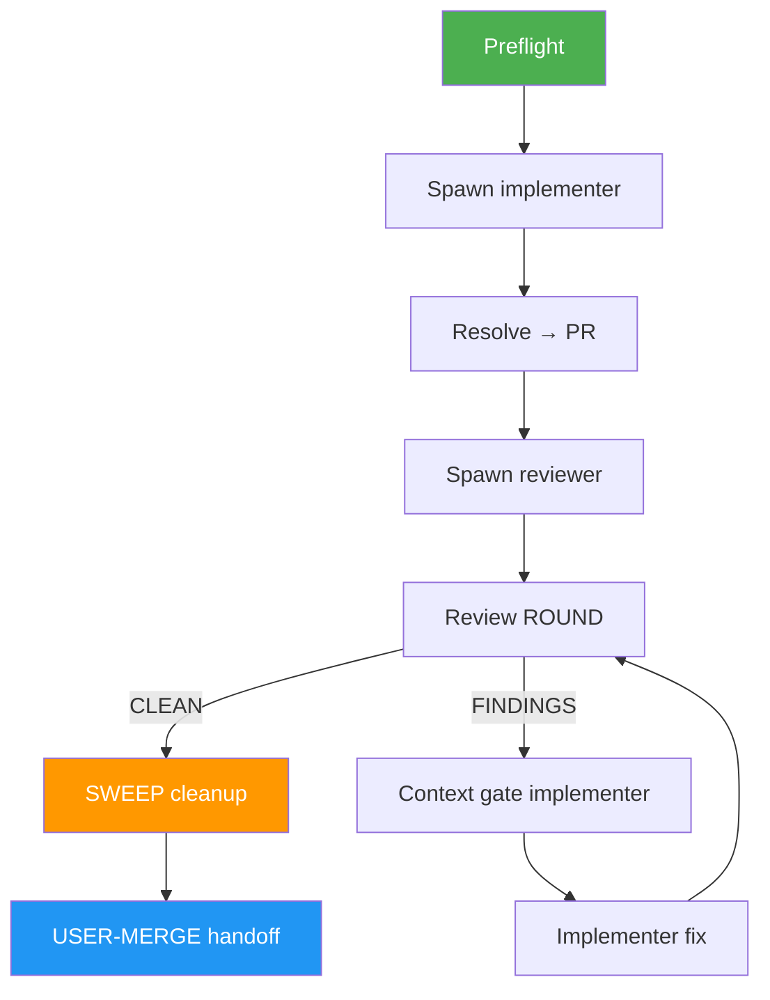

<!--
  DO NOT READ THIS FILE — This README.md is for human catalog browsing only.
  It ships inside the .skill package but is NEVER auto-loaded into agent context.
  The runtime loader only reads SKILL.md + references/ + scripts/ + agents/ when the skill triggers.
  If you're an AI agent, read the SKILL.md file instead for skill instructions.
-->

# Issue Work Loop

> Resolve one GitHub issue with a Herdr implementer/reviewer pair until review is clean — human owns the merge.

## Highlights

- Spins up an **implementer** pane that runs `/issue-resolver` and opens a PR
- Spins up a **reviewer** pane that runs `/issue-pr-review --review-only`
- Loops fix → re-review until zero findings (**notes count**)
- **Freshen** the reviewer at ROUND start and the implementer before each fix when context is ≥ 50%
- **SWEEP** at the end: close worker panes, remove loop worktrees, return to default branch
- **Never merges** — leaves a clean workspace and an open PR for you

## When to Use

| Say this... | Skill will... |
|---|---|
| "Work issue #42 with implementer + reviewer until clean" | Resolve + review loop on #42 |
| "/issue-work-loop 42" | Same, structured invocation |
| "Implementer and reviewer for #42" | Herdr pair until clean |

**Don't use for:** multi-issue backlog autopilot (`/auto-pilot`), review-only of an existing PR (`/issue-pr-review`), or merge automation.

## How It Works



## Usage

```text
/issue-work-loop 42
/issue-work-loop 42 --max-rounds 3
/issue-work-loop 42 --agent-cli "pi --thinking high"
/issue-work-loop 42 --no-cleanup
```

## Resources

| Path | Description |
|---|---|
| `SKILL.md` | Orchestrator instructions |
| `references/loop-protocol.md` | ROUND state machine |
| `references/agent-prompts.md` | Worker prompts |
| `references/context-gate.md` | 50% freshen rules |
| `references/cleanup.md` | End-of-loop SWEEP (panes, worktrees, branch) |
| `references/output-format.md` | Terminal reports |
| `references/error-messages.md` | Error catalog |

## Output

- Open PR linked to the issue
- Round-by-round review/fix log
- Clean local workspace (panes closed, worktrees removed, on default branch)
- Final `CLEAN` / `MAX_ROUNDS` / `FAILED` handoff (no merge)
