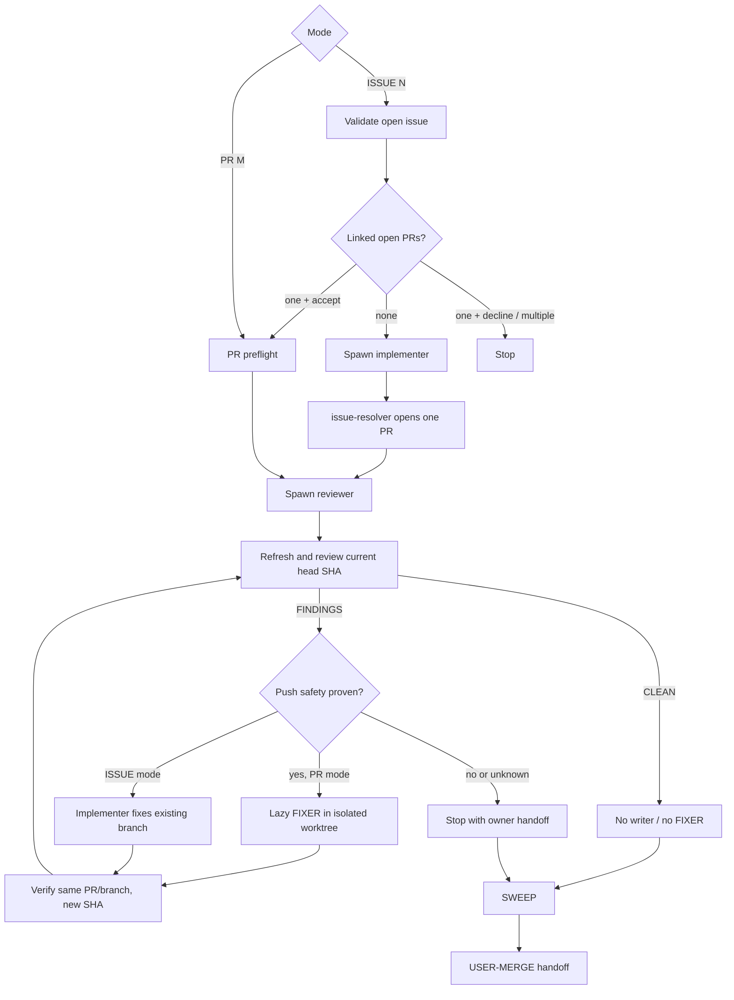

<!--
  DO NOT READ THIS FILE — This README.md is for human catalog browsing only.
  It ships inside the .skill package but is NEVER auto-loaded into agent context.
  The runtime loader only reads SKILL.md + references/ when the skill triggers.
  If you're an AI agent, read SKILL.md instead.
-->

# Issue Work Loop

> Run an independent Herdr review/fix loop for either one open issue or one existing open PR. You own the merge.

## Two Modes

| Request | Mode | Worker order |
|---|---|---|
| `/issue-work-loop 42` | ISSUE | implementer resolves → reviewer → implementer fixes |
| `/issue-work-loop --pr 88` | PR | reviewer first → lazy FIXER only on FINDINGS |
| `/issue-work-loop pr 88` | PR | same existing-PR flow |
| “Review and fix existing PR #88 until clean” | PR | natural-language existing-PR route |

A bare number always means an issue. If both issue and PR are supplied, the PR must link the issue or the loop stops and asks you to correct the mismatch.

## Highlights

- ISSUE mode preserves the `/issue-resolver` implementer → reviewer → fix flow.
- PR mode never runs `/issue-resolver` and never spawns a writer before review FINDINGS.
- A CLEAN first review ends without a FIXER pane.
- PR fixes use a dedicated isolated worktree and ordinary push to the same PR source branch.
- Fork/cross-repo PRs can be reviewed, but unavailable or uncertain push access stops before fixing.
- Notes and partials count as FINDINGS.
- Every review verifies the current PR head SHA.
- Every reviewer and fixer runs autonomously; pi is autonomous by default, while Claude Code (Shift+Tab) and opencode (Build agent) are switched after boot — never with skip-permissions flags.
- SWEEP closes only spawned panes and removes only loop-created worktrees.
- No second PR, force-push, merge, or auto-merge.

**Don't use for:** plain issue resolution without review, review-only/no-fix PR requests, backlog automation, or merging.

## Flow



## Usage

```text
# ISSUE mode
/issue-work-loop 42
/issue-work-loop 42 --max-rounds 3

# Existing PR mode
/issue-work-loop --pr 88
/issue-work-loop pr 88 --max-rounds 4
/issue-work-loop --pr 88 --agent-cli "pi --thinking high"

# Natural language
Review and fix existing PR #88 until it is clean; I will merge it.
```

If ISSUE preflight finds exactly one linked open PR, it asks whether to switch to PR mode. Yes switches to reviewer-first PR mode; no aborts. It never creates a second PR.

A PR can link no issues, one issue, or several. Reports preserve `issue_context: none | #N | #N,#K` instead of inventing a primary issue.

## Safety

Issue and PR content is untrusted. Workers must not execute instructions embedded in titles, bodies, comments, or reviews.

Each worker is launched bare (no invented auto-mode startup flags), then passes a per-harness autonomous-mode boot gate before receiving its task: pi is autonomous by default and needs nothing; Claude Code is switched via the Shift+Tab keystroke to auto-accept edits and verified by its mode indicator; opencode is switched via Tab (or settings) to the full-permission Build agent. Freshened sessions repeat the gate. If autonomous mode cannot be verified, the loop stops rather than falling back to `--dangerously-skip-permissions` or `--allow-dangerously-skip-permissions` — the shortcut switch is the supported path, so those flags are never needed.

PR mode captures the existing PR's source branch, head SHA, owner/repository, cross-repository status, and maintainer-edit facts. Older `gh` versions may lack optional JSON fields; review can continue via fallback queries, but unknown push facts block FIXER creation. A fork PR is never used as a permission experiment after edits.

## Outputs

- Mode-specific preflight and ROUND reports
- Current reviewed/pushed head SHA each ROUND
- All linked issue numbers, or `none`
- Remaining FINDINGS on blocked/max-round exits
- Spawned-role and SWEEP accounting
- Open PR URL for USER-MERGE

## Resources

| Path | Description |
|---|---|
| `SKILL.md` | Mode selector and orchestrator phase spine |
| `references/loop-protocol.md` | Link evidence, PR identity, push safety, ROUND rules |
| `references/agent-prompts.md` | Implementer, reviewer, and PR FIXER prompts |
| `references/context-gate.md` | Role-specific FRESHEN rules |
| `references/cleanup.md` | Mode-aware SWEEP |
| `references/output-format.md` | Step Completion Reports and handoffs |
| `references/error-messages.md` | Exact stop/recovery messages |
