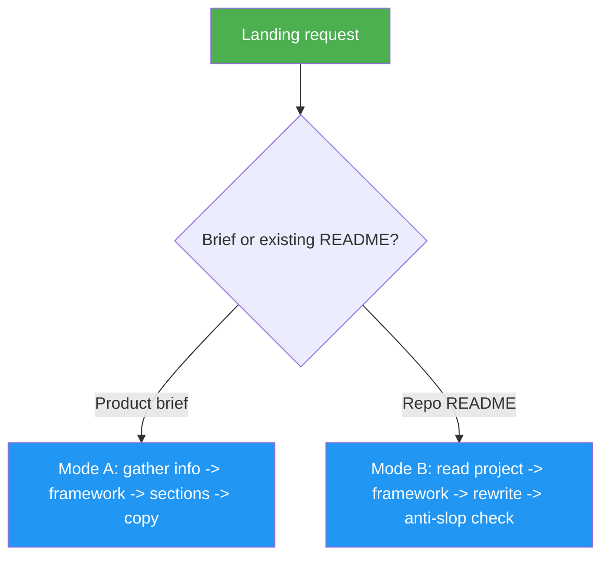

<!--
  DO NOT READ THIS FILE — This README.md is for human catalog browsing only.
  It ships inside the .skill package but is NEVER auto-loaded into agent context.
  The runtime loader only reads SKILL.md + references/ + scripts/ + agents/ when the skill triggers.
  If you're an AI agent, read the SKILL.md file instead for skill instructions.
-->

# Landing Page Generator

> The one skill for landing-page work. Two modes: generate conversion-focused landing page copy
> from a product brief (PAS, AIDA, StoryBrand), or transform an existing project README into a
> scannable, visual, developer-friendly landing page.

## Highlights

- Two modes, one skill: marketing **copy from a brief**, or a **README → landing page** rewrite
- Proven copywriting frameworks: PAS, AIDA, and StoryBrand
- Complete page sections: framework-specific narrative blocks, how it works, social proof, FAQ, and closing CTA
- README mode: mermaid diagrams, tables over prose, all original content preserved in `<details>`
- Anti-slop rules to avoid generic AI marketing filler
- A/B test ideas and conversion optimization notes with every copy deliverable

## When to Use

| Say this... | Skill will... |
|---|---|
| "Write landing page copy for my SaaS" | **Mode A** — generate full page copy using the best-fit framework |
| "Create sales page content using PAS" | **Mode A** — structure copy around Problem-Agitate-Solution |
| "Generate hero section copy" | **Mode A** — produce headline, subheadline, CTA, and trust bar |
| "Turn my README into a landing page" | **Mode B** — rewrite README with visual-first landing page structure |
| "Make my GitHub page sell the project" | **Mode B** — apply a framework with mermaid diagrams, preserve technical detail |

## How It Works



## Usage

```
/landing-page-generator
```

## Resources

| Path | Description |
|---|---|
| `references/section-templates.md` | Mode A output format for all landing page sections |
| `references/anti-slop-rules.md` | Banned phrases and structural patterns (both modes) |
| `references/readme-mode.md` | Mode B — full README-to-landing-page workflow |
| `references/readme-section-templates.md` | Mode B section flow for the rewritten README |
| `references/readme-step-reports.md` | Mode B step-completion report format |

## Output

- **Mode A** — structured landing page copy delivered in chat (hero through final CTA) plus A/B test
  ideas and conversion tips. Not HTML, wireframes, or design files unless the user asks for a
  specific copy-only format.
- **Mode B** — a rewritten `README.md` (visual-first, scannable, mermaid-driven) with the original
  preserved in `README.backup.md` and collapsed `<details>` blocks.
