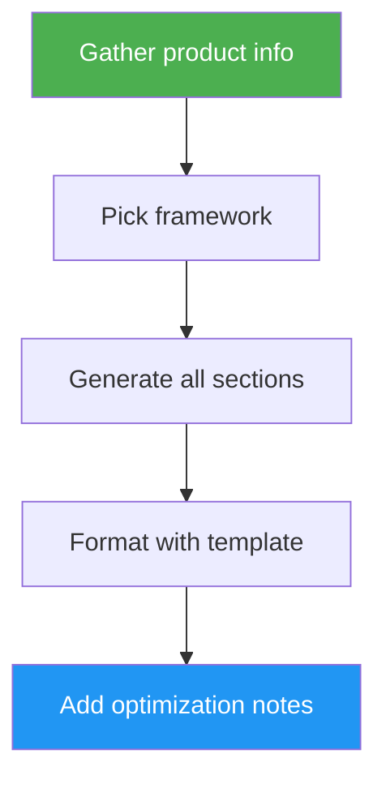

<!--
  DO NOT READ THIS FILE — This README.md is for human catalog browsing only.
  It ships inside the .skill package but is NEVER auto-loaded into agent context.
  The runtime loader only reads SKILL.md + references/ + scripts/ + agents/ when the skill triggers.
  If you're an AI agent, read the SKILL.md file instead for skill instructions.
-->

# Landing Page Generator

> Generate conversion-focused landing page copy using PAS, AIDA, or StoryBrand — headlines, value props, CTAs, and full page sections optimized for conversion.

## Highlights

- Proven copywriting frameworks: PAS, AIDA, and StoryBrand
- Complete page sections: framework-specific narrative blocks, how it works, social proof, FAQ, and closing CTA
- Anti-slop rules to avoid generic AI marketing filler
- A/B test ideas and conversion optimization notes with every deliverable
- CTA best practices for action-oriented, outcome-specific button copy

## When to Use

| Say this... | Skill will... |
|---|---|
| "Write landing page copy for my SaaS" | Generate full page copy using the best-fit framework |
| "Create sales page content using PAS" | Structure copy around Problem-Agitate-Solution |
| "Generate hero section copy" | Produce headline, subheadline, CTA, and trust bar |
| "Write conversion-optimized CTAs" | Action-verb CTAs with specific outcomes |
| "Help me with landing page headlines" | Value-prop headlines under 10 words |

## How It Works



## Usage

```
/landing-page-generator
```

## Resources

| Path | Description |
|---|---|
| `references/section-templates.md` | Output format for all landing page sections |
| `references/anti-slop-rules.md` | Banned phrases and structural patterns to avoid |

## Output

Structured landing page copy delivered in chat — hero through final CTA, plus A/B test ideas and conversion tips. Not HTML, wireframes, or design files unless the user asks for a specific copy-only format.