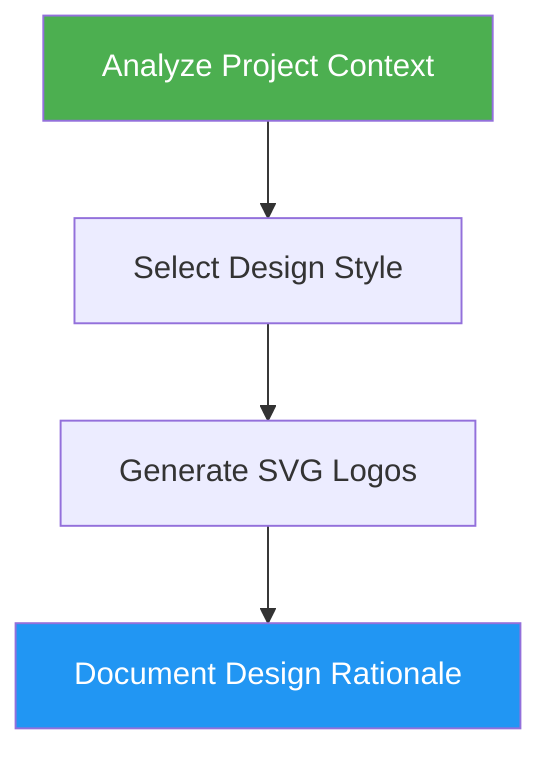

# Logo Designer

> Design professional, modern logos with automatic project context detection and multiple SVG deliverables.

## Highlights

- Analyze project type (CLI, SaaS, Startup, Enterprise, Consumer) for style selection
- Apply design principles: simplicity, scalability, memorability, versatility
- Generate 7 SVG variants (full, mark, wordmark, icon, favicon, white, black)
- Provide color specs with hex codes and Tailwind config

## When to Use

| Say this... | Skill will... |
|---|---|
| "Create a logo" | Design logo based on project analysis |
| "Design a logo for X" | Generate brand identity with SVG files |
| "Make a favicon" | Create icon and favicon variants |
| "Generate brand identity" | Full logo suite with color specs |

## How It Works



## Installation

Install via [npx (Vercel)](https://www.npmjs.com/package/skills):

```bash
npx skills add https://github.com/luongnv89/skills --skill logo-designer
```

Or via [agent-skill-manager (asm)](https://www.npmjs.com/package/agent-skill-manager):

```bash
asm install github:luongnv89/skills:skills/logo-designer
```

## Usage

```
/logo-designer
```

## Resources

| Path | Description |
|---|---|
| `agents/brand-researcher.md` | Read project files to produce structured brand brief |
| `agents/svg-generator.md` | Generate all 7 SVG logo files (full, mark, wordmark, icon, favicon, white, black) |
| `agents/svg-reviewer.md` | Validate SVG structure, completeness, and compatibility |

## Output

- 7 SVG files in `/assets/logo/` (full, mark, wordmark, icon, favicon, white, black)
- Design rationale document with color specifications
- Brand kit suggestions with Tailwind config
