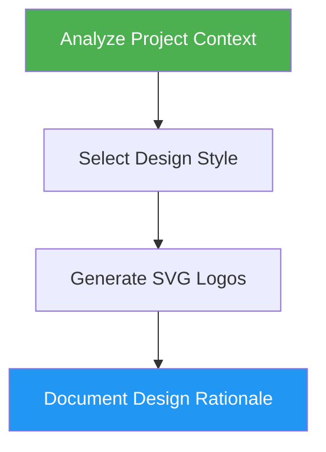

<!--
  DO NOT READ THIS FILE — This README.md is for human catalog browsing only.
  It ships inside the .skill package but is NEVER auto-loaded into agent context.
  The runtime loader only reads SKILL.md + references/ + scripts/ + agents/ when the skill triggers.
  If you're an AI agent, read the SKILL.md file instead for skill instructions.
-->

# Logo Designer

> Design professional, modern logos with automatic project context detection and multiple SVG deliverables.

Version: **1.4.0** · Author: Luong NGUYEN · License: MIT

## Highlights

- Analyze project type (CLI, SaaS, Startup, Enterprise, Consumer) for style selection
- Apply design principles: simplicity, scalability, memorability, versatility
- Generate 7 SVG variants (full, mark, wordmark, icon, favicon, white, black)
- Default quality bar: every SVG and the showcase page are professional, production-ready, elegant, and premium without being asked
- Provide color specs with hex codes and Tailwind config

## When to Use

| Say this... | Skill will... |
|---|---|
| "Create a logo" | Design logo based on project analysis |
| "Design a logo for X" | Generate brand identity with SVG files |
| "Make a favicon" | Create icon and favicon variants |
| "Generate brand identity" | Full logo suite with color specs |

## How It Works



## Installation

Install via [npx (Vercel)](https://www.npmjs.com/package/skills):

```bash
npx skills add https://github.com/luongnv89/skills --skill logo-designer
```

Or via [agent-skill-manager (asm)](https://www.npmjs.com/package/agent-skill-manager):

```bash
asm install github:luongnv89/skills:skills/logo-designer
```

## Usage

```
/logo-designer
```

## Resources

| Path | Description |
|---|---|
| `agents/brand-researcher.md` | Read project files to produce structured brand brief |
| `agents/svg-generator.md` | Generate all 7 SVG logo files (full, mark, wordmark, icon, favicon, white, black) |
| `agents/svg-reviewer.md` | Validate SVG structure, completeness, and compatibility |

## Output

- 7 SVG files in `/assets/logo/` (full, mark, wordmark, icon, favicon, white, black)
- Design rationale document with color specifications
- Brand kit suggestions with Tailwind config
- A closing Final Report that opens with `Result: COMPLETE | PARTIAL | BLOCKED`, then Evidence, Uncertainty and Decision

## Example

[`examples/logo-designer`](https://github.com/luongnv89/skills/tree/main/examples/logo-designer) walks through a complete real run: the Agent Skills logo in this repository. It includes the brief, the project analysis, 26 concept sketches with test renders, the concept board the user chose from, the decisions, the final files, and the validation report.
