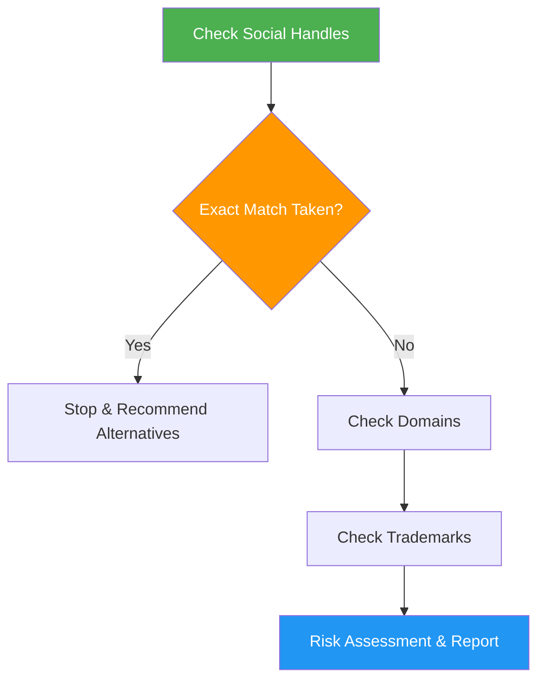

# Name Checker

> Check product and brand names for social media, domain, and trademark conflicts with risk assessment.

## Highlights

- Priority-based checking: social handles, domains, then trademarks
- Critical stop rule if exact social handle is already taken
- Risk assessment with Low, Moderate, or High conflict rating
- Generate alternative name suggestions with registration order

## When to Use

| Say this... | Skill will... |
|---|---|
| "Check this name" | Run full availability check |
| "Is this name available?" | Check social, domain, and trademark |
| "Validate a product name" | Assess risk and suggest alternatives |

## How It Works



## Usage

```
/name-checker <name>
```

## Output

Status summary covering social media (6 platforms), domains (.com, .io, .app, .co), trademark databases (WIPO, EUIPO, INPI), risk level with reasoning, and alternative suggestions with registration order.
