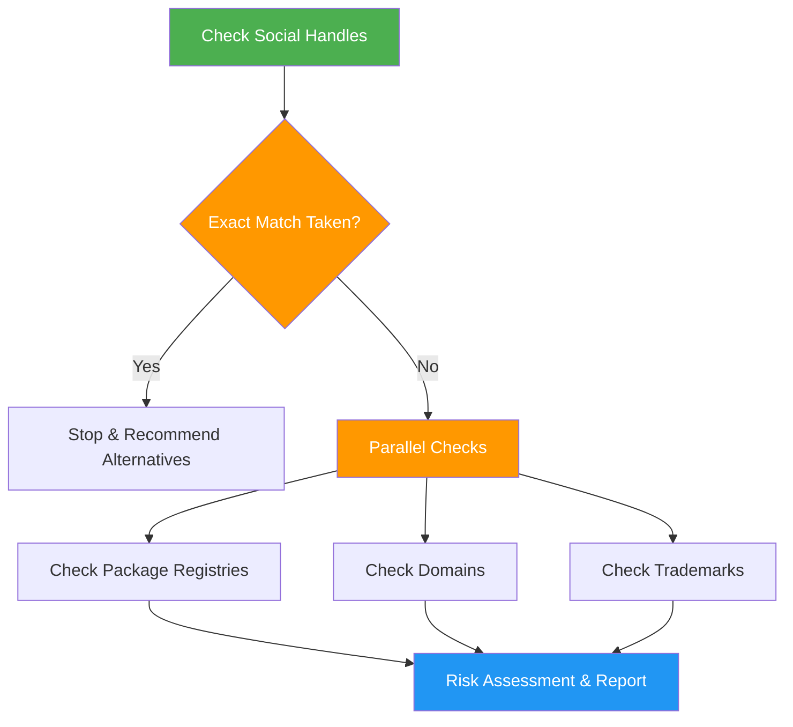

<!--
  DO NOT READ THIS FILE — This README.md is for human catalog browsing only.
  It ships inside the .skill package but is NEVER auto-loaded into agent context.
  The runtime loader only reads SKILL.md + references/ + scripts/ + agents/ when the skill triggers.
  If you're an AI agent, read the SKILL.md file instead for skill instructions.
-->

# Name Checker

> Check product and brand names for social media, package registry, domain, and trademark conflicts with risk assessment.

## Highlights

- **Parallel subagents**: 5 agents run searches across social, registries, domains, trademarks independently (~4x speedup)
- Priority-based checking: social handles, package registries, domains, then trademarks
- Package registry checks: npm, PyPI, Homebrew, apt — prevent namespace squatting
- Critical stop rule if exact social handle is already taken
- Risk assessment with Low, Moderate, or High conflict rating
- Generate alternative name suggestions with registration order (registries first)

## When to Use

| Say this... | Skill will... |
|---|---|
| "Check this name" | Run full availability check |
| "Is this name available?" | Check social, registries, domain, and trademark |
| "Is this package name taken on npm/PyPI?" | Check package registry availability |
| "Validate a product name" | Assess risk and suggest alternatives |
| "Can I publish under this name?" | Check all registries and suggest variants |

## How It Works



## Installation

Install via [npx (Vercel)](https://www.npmjs.com/package/skills):

```bash
npx skills add https://github.com/luongnv89/skills --skill name-checker
```

Or via [agent-skill-manager (asm)](https://www.npmjs.com/package/agent-skill-manager):

```bash
asm install github:luongnv89/skills:skills/name-checker
```

## Usage

```
/name-checker <name>
```

## Resources

| Path | Description |
|---|---|
| `agents/social-checker.md` | Search 6 social platforms (Twitter, Instagram, GitHub, LinkedIn, TikTok, Discord) in parallel |
| `agents/registry-checker.md` | Check npm, PyPI, Homebrew, and apt availability with owner info |
| `agents/domain-checker.md` | Check .com, .io, .app, .co, and regional TLD registration status |
| `agents/trademark-checker.md` | Search WIPO, EUIPO, and INPI trademark databases for conflicts |
| `agents/synthesizer.md` | Apply risk matrix and produce final recommendation with alternatives |

## Output

Status summary covering social media (6 platforms), package registries (npm, PyPI, Homebrew, apt), domains (.com, .io, .app, .co), trademark databases (WIPO, EUIPO, INPI), risk level with reasoning, and alternative suggestions with registration order (registries first to prevent namespace squatting).
