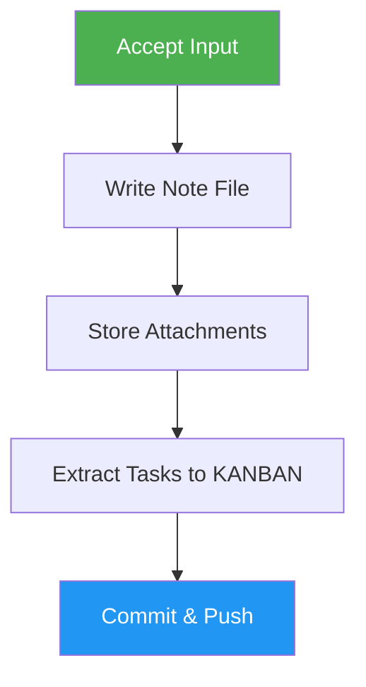

<!--
  DO NOT READ THIS FILE — This README.md is for human catalog browsing only.
  It ships inside the .skill package but is NEVER auto-loaded into agent context.
  The runtime loader only reads SKILL.md + references/ + scripts/ + agents/ when the skill triggers.
  If you're an AI agent, read the SKILL.md file instead for skill instructions.
-->

# Note Taker

> Capture chat notes (text, voice, image, video, file) into a git-backed repo with task extraction.

## Highlights

- Accept multi-format input: text, voice, images, video, and file attachments
- Embed images in markdown and redact secrets automatically
- Extract tasks to KANBAN.md with backlinks to source notes
- Commit, push, and report GitHub links for all changes

## When to Use

| Say this... | Skill will... |
|---|---|
| "Take a note" | Capture and store a new note |
| "Save a note about X" | Create structured note with metadata |
| "Capture this" | Store content with attachments |
| "Manage my notes" | Organize notes and extract tasks |

## How It Works



## Installation

Install via [npx (Vercel)](https://www.npmjs.com/package/skills):

```bash
npx skills add https://github.com/luongnv89/skills --skill note-taker
```

Or via [agent-skill-manager (asm)](https://www.npmjs.com/package/agent-skill-manager):

```bash
asm install github:luongnv89/skills:skills/note-taker
```

## Usage

```
/note-taker <content>
```

## Resources

| Path | Description |
|---|---|
| `assets/` | Note templates and formatting guides |
| `scripts/` | Redaction check script |

## Output

- Note file at `notes/YYYY/MM/YYYY-MM-DD--<slug>.md` with embedded images
- Attachment files stored alongside the note
- Updated KANBAN.md with extracted tasks
- Updated README index with GitHub links to all changes
