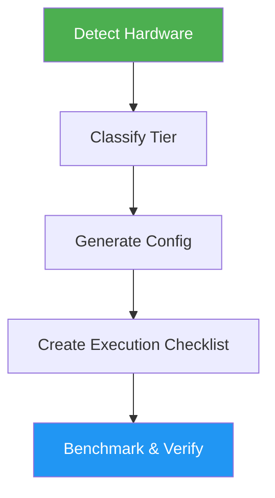

# Ollama Optimizer

> Optimize Ollama configuration for maximum performance based on detected hardware capabilities.

## Highlights

- Detect CPU, RAM, GPU, and driver versions automatically
- Classify hardware tier and recommend maximum model size
- Special Apple Silicon handling for unified memory allocation
- Generate benchmark commands and rollback instructions

## When to Use

| Say this... | Skill will... |
|---|---|
| "Optimize Ollama" | Tune config for current hardware |
| "Ollama running slow" | Diagnose and fix performance issues |
| "Setup local LLM" | Configure Ollama with optimal settings |
| "Speed up Ollama" | Apply environment variable tuning |

## How It Works



## Installation

Install via [npx (Vercel)](https://www.npmjs.com/package/skills):

```bash
npx skills add https://github.com/luongnv89/skills --skill ollama-optimizer
```

Or via [agent-skill-manager (asm)](https://www.npmjs.com/package/agent-skill-manager):

```bash
asm install github:luongnv89/skills:skills/ollama-optimizer
```

## Usage

```
/ollama-optimizer
```

## Resources

| Path | Description |
|---|---|
| `references/` | Hardware tier classification and tuning guides |
| `scripts/` | System detection script (detect_system.py) |

## Output

`ollama-optimization-guide.md` with system overview, environment variable recommendations, model selection guidance, execution checklist, verification commands, and rollback instructions.
