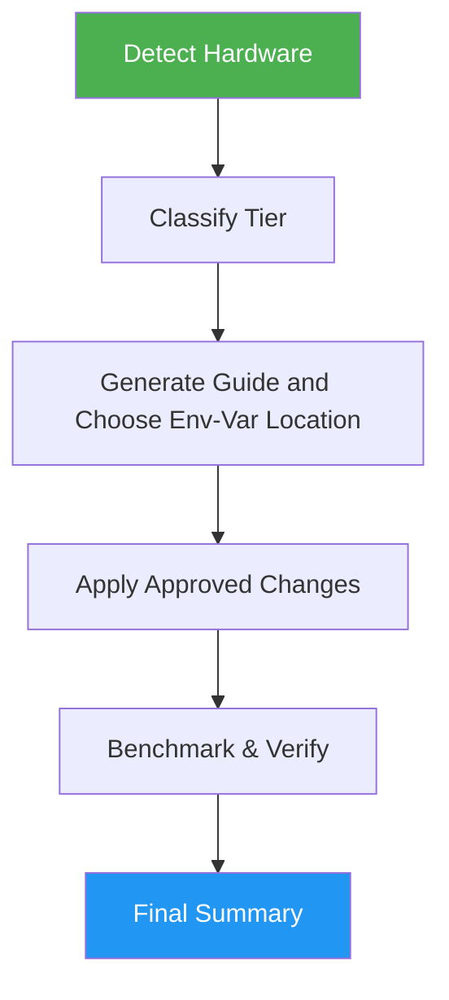

<!--
  DO NOT READ THIS FILE — This README.md is for human catalog browsing only.
  It ships inside the .skill package but is NEVER auto-loaded into agent context.
  The runtime loader only reads SKILL.md + references/ + scripts/ + agents/ when the skill triggers.
  If you're an AI agent, read the SKILL.md file instead for skill instructions.
-->

# Ollama Optimizer

> Optimize Ollama configuration for maximum performance based on detected hardware capabilities.

## Highlights

- Detect CPU, RAM, GPU, and driver versions automatically
- Classify hardware tier and recommend maximum model size
- Special Apple Silicon handling for unified memory allocation
- Put env vars where the running Ollama reads them (shell, Ollama.app, systemd, Windows, Docker), with a backup and a one-command rollback
- Change nothing without your approval for each command; a recommendations-only run changes nothing

## When to Use

| Say this... | Skill will... |
|---|---|
| "Optimize Ollama" | Tune config for current hardware |
| "Ollama running slow" | Diagnose and fix performance issues |
| "Setup local LLM" | Configure Ollama with optimal settings |
| "Which models fit my GPU?" | Recommend model sizes and quantization for your tier |

Not for LM Studio, llama.cpp, vLLM, or hosted LLM APIs.

## How It Works



## Installation

Install via [npx (Vercel)](https://www.npmjs.com/package/skills):

```bash
npx skills add https://github.com/luongnv89/skills --skill ollama-optimizer
```

Or via [agent-skill-manager (asm)](https://www.npmjs.com/package/agent-skill-manager):

```bash
asm install github:luongnv89/skills:skills/ollama-optimizer
```

## Usage

```
/ollama-optimizer
```

## Resources

| Path | Description |
|---|---|
| `references/vram_requirements.md` | VRAM tiers, Apple Silicon unified memory, quantization guide, model size formula |
| `references/environment_variables.md` | Ollama env var reference and how to set them permanently per platform |
| `references/platform_specific.md` | macOS, Linux (NVIDIA, AMD, systemd), Windows, and Docker setup |
| `references/report-template.md` | Step report examples, guide template, final summary fill rules, reader checks |
| `scripts/detect_system.py` | Read-only hardware and Ollama detection; prints JSON with `hardware_tier` |
| `scripts/benchmark_ollama.py` | Benchmarks installed models with `ollama run --verbose`; prints JSON with tokens/s |
| `evals/evals.json` | Nine test prompts: happy paths, edge cases (recommendations only, Ollama missing, declined change, nothing to change, unknown VRAM), and negative triggers |

## Output

- `ollama-optimization-guide.md` with system overview, current configuration, env var and model recommendations, an execution checklist, verification commands, and rollback instructions. If you decline a file, the guide is printed in the reply.
- A final summary that opens with `Result: COMPLETE | PARTIAL | BLOCKED`, followed by `Evidence:`, `Uncertainty:`, and `Decision:` lines, plus any `Remaining action:` lines for you.
