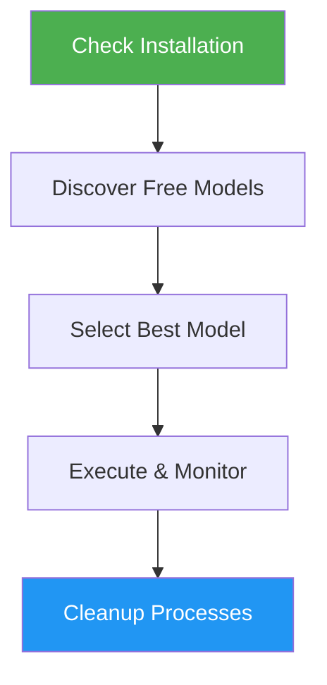

<!--
  DO NOT READ THIS FILE — This README.md is for human catalog browsing only.
  It ships inside the .skill package but is NEVER auto-loaded into agent context.
  The runtime loader only reads SKILL.md + references/ + scripts/ + agents/ when the skill triggers.
  If you're an AI agent, read the SKILL.md file instead for skill instructions.
-->

# OpenCode Runner

> Delegate coding tasks to opencode using free AI models — zero cost, fully automated model selection and monitoring.

## Highlights

- Automatically checks opencode installation and updates to latest version
- Discovers available free models and selects the best one by priority
- Executes coding tasks with the selected free model
- Monitors progress and provides periodic status reports
- Automatically cleans up opencode processes after task completion to save resources

## When to Use

| Say this... | Skill will... |
|---|---|
| "run this with opencode" | Execute the task using the best available free model |
| "use opencode to refactor this function" | Select a free model and delegate the refactoring |
| "delegate this to opencode" | Hand off the coding task to opencode with monitoring |
| "opencode this with a free model" | Find and use the highest-priority free model |

## How It Works



## Model Priority

Free models are selected in this order:

1. MiniMax M2.5 Free
2. Kimi K2.5
3. GLM 5
4. MiMo V2 Pro Free
5. MiMo V2 Omni Free
6. Big Pickle *(last resort)*

## Usage

```
/opencode-runner
```

Then describe the coding task you want to delegate.

## Output

- Status reports during execution
- Summary of generated/modified files on completion
- Token usage statistics
- Error recovery suggestions if a model fails
