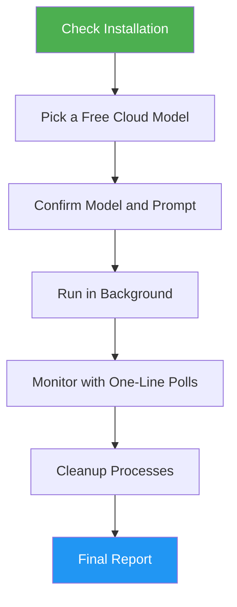

<!--
  DO NOT READ THIS FILE — This README.md is for human catalog browsing only.
  It ships inside the .skill package but is NEVER auto-loaded into agent context.
  The runtime loader only reads SKILL.md + references/ + scripts/ + agents/ when the skill triggers.
  If you're an AI agent, read the SKILL.md file instead for skill instructions.
-->

# OpenCode Runner

> Delegate coding tasks to opencode using free cloud models — zero cost, with a model picker, a pre-run confirmation, low-token monitoring and guaranteed cleanup.

## Highlights

- Checks the opencode installation and upgrades it to the latest version
- Lists the free `opencode/*` cloud models and lets you pick one, with a priority-1 default
- Shows a one-screen summary (model, working directory, files, prompt) and waits for your confirmation
- Runs opencode in the background and polls a one-line status, so the full log never floods the context
- Kills every `opencode run` process and removes its temp files on every exit path, then checks none remain
- Ends with a final report: result, evidence, uncertainty and the next decision

## When to Use

| Say this... | Skill will... |
|---|---|
| "run this with opencode" | Pick a free cloud model with you, confirm, and delegate the task |
| "use opencode to refactor this function" | Delegate the refactoring to opencode and monitor it |
| "delegate this to opencode" | Hand off the coding task, poll its progress, and clean up |
| "opencode this with a free model" | Offer the free models in priority order and run the one you choose |

Not for local models (Ollama, LM Studio), direct Claude or OpenAI calls, or work Claude should do itself.

## How It Works


```mermaid
graph TD
    A["Check Installation"] --> B["Pick a Free Cloud Model"]
    B --> C["Confirm Model and Prompt"]
    C --> D["Run in Background"]
    D --> E["Monitor with One-Line Polls"]
    E --> F["Cleanup Processes"]
    F --> G["Final Report"]
    style A fill:#4CAF50,color:#fff
    style G fill:#2196F3,color:#fff
```

## Model Priority

When you accept the default, the first available model in this order is used:

1. `opencode/deepseek-v4-flash-free`
2. `opencode/minimax-m2.5-free`
3. `opencode/nemotron-3-super-free`
4. `opencode/big-pickle`
5. `opencode/gpt-5-nano` *(only when opencode lists it at $0)*

Any other `opencode/*` model whose ID ends in `-free` is also offered.

## Usage

```
/opencode-runner
```

Then describe the coding task you want to delegate.

## Resources

| Path | Description |
|---|---|
| `references/expected-output.md` | Example output for each phase and the per-phase step reports |
| `references/final-report.md` | Final report status rules, examples and reader checks |

## Output

- A short status line per poll while opencode runs
- The changed files (from `git status --porcelain` in a git repository) and the token count opencode printed
- A cleanup confirmation, checked with `pgrep`
- A final report: `Result:` (`COMPLETE`, `PARTIAL` or `BLOCKED`), `Evidence:`, `Uncertainty:` and `Decision:`
