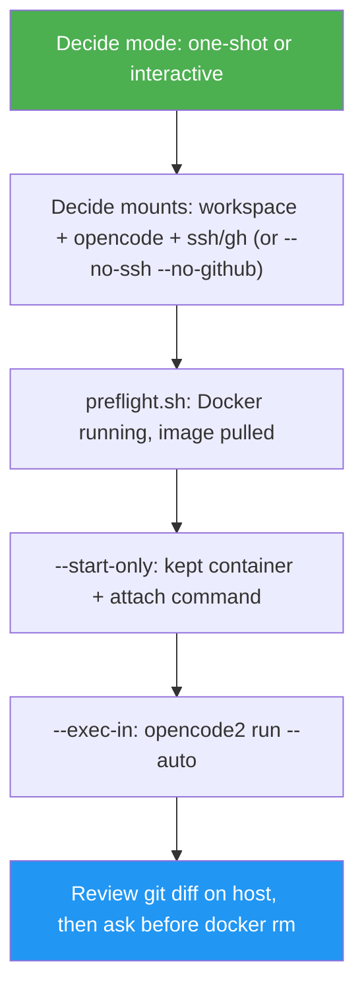

<!--
  DO NOT READ THIS FILE — This README.md is for human catalog browsing only.
  It ships inside the .skill package but is NEVER auto-loaded into agent context.
  The runtime loader only reads SKILL.md + references/ + scripts/ + agents/ when the skill triggers.
  If you're an AI agent, read the SKILL.md file instead for skill instructions.
-->

# OpenCode Sandbox

> Run OpenCode inside a luongnv89/docker-dev container. SSH and GitHub auth are on by default so commit/push/PR work; pass `--no-ssh --no-github` to isolate. The container is kept by default so you can attach a shell.

## Highlights

- One-shot mode uses **`--start-only` then `--exec-in`**: a named keep-alive container, a copy-paste `docker exec -it <name> zsh` attach command *before* OpenCode runs, then `opencode2 run --auto` via `docker exec` (falling back to `opencode` for older images) — a plain exit code, no TUI to drive or permission dialogs to click through
- Container is **kept by default**; the agent asks before `docker rm`. Pass `--rm` only when you already want it gone
- SSH (`~/.ssh`) and GitHub (`gh` config + token) are **on by default** so the container can commit, push, and open/merge PRs. Pass `--no-ssh --no-github` to isolate an untrusted task
- Handles the `~/.claude` → `~/.agents` symlink gotcha automatically when mounting Claude Code skills into the container
- Interactive mode (pairs with herdr-agent-comms or tmux-agent-comms) documents the OpenCode-specific TUI timing and permission-dialog quirks discovered while building this skill

## When to Use

| Say this...                                                        | Skill will...                                                                 |
| ------------------------------------------------------------------- | ------------------------------------------------------------------------------ |
| "Run OpenCode on this project and open the PR"                      | Default SSH/gh mounts, run OpenCode, container can `gh pr create`             |
| "Run OpenCode without giving it my SSH key"                         | Same flow with `--no-ssh --no-github`, then review the host diff              |
| "OpenCode keeps hitting rate limits, try it in a fresh container"   | Launch a fresh container session (kept until you confirm cleanup)             |

## How It Works

## Usage

Model-invoked — ask to run OpenCode in a container (with git/gh by default), isolate it with `--no-ssh --no-github`, or dodge rate limits in a fresh container.

## Resources

| Path                                        | Description                                                                 |
| -------------------------------------------- | ----------------------------------------------------------------------------- |
| `scripts/preflight.sh`                       | Ensures Docker is running and the image is pulled                            |
| `scripts/run_opencode.sh`                    | `--start-only` then `--exec-in`: kept container, attach command, `opencode2 run --auto` (fallback: `opencode`) |
| `references/mounts-and-credentials.md`       | Default SSH/GitHub mounts, `--no-ssh`/`--no-github` opt-out, `~/.claude` symlink gotcha |
| `references/interactive-mode.md`             | TUI readiness timing, permission dialogs, completion detection               |
| `references/troubleshooting.md`              | Provider errors, rate limits, outdated `cdev`, dependency-file leakage       |

## Output

A completed OpenCode task run against the mounted project directory, a
copy-paste `docker exec -it <name> zsh` attach command, a prompt asking
whether to remove the kept container, plus a Step Completion Report showing
mounts used, exit code, attach shown, container kept/removed, and whether
the host diff was reviewed before anything ships. One-shot mode's raw
output is whatever `opencode2 run` (or the older `opencode run`) printed (or JSON events, with
`--format json`).
