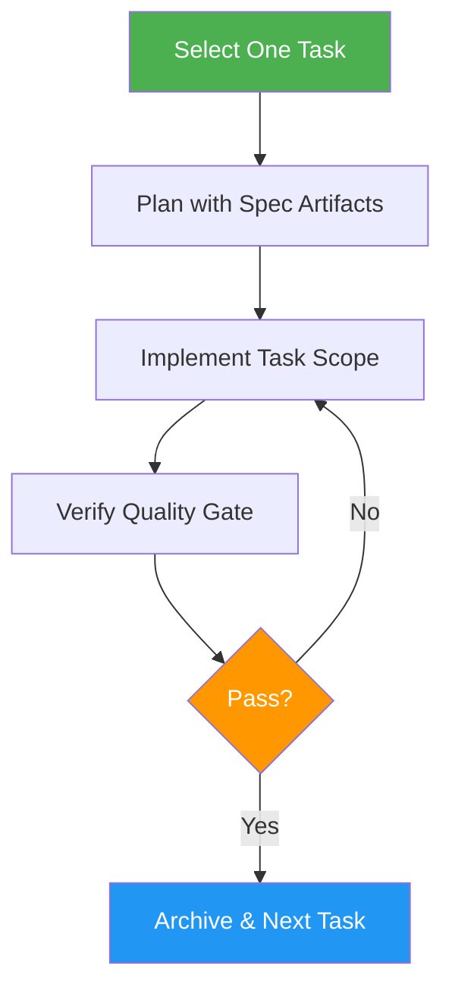

# OpenSpec Task Loop

> Execute work in a strict one-task-at-a-time loop with spec-first implementation using OpenSpec OPSX.

## Highlights

- Atomic single-task workflow: one change equals one value unit
- Spec artifact generation (proposal, design, tasks, specs) before implementation
- Quality gate validation before archival
- Support native OPSX commands with manual fallback

## When to Use

| Say this... | Skill will... |
|---|---|
| "Execute work as single-task changes" | Run atomic task loop |
| "Spec-first implementation" | Plan with artifacts before coding |
| "Use OpenSpec method" | Follow OPSX workflow strictly |

## How It Works



## Installation

Install via [npx (Vercel)](https://www.npmjs.com/package/skills):

```bash
npx skills add https://github.com/luongnv89/skills --skill openspec-task-loop
```

Or via [agent-skill-manager (asm)](https://www.npmjs.com/package/agent-skill-manager):

```bash
asm install github:luongnv89/skills --skill openspec-task-loop
```

## Usage

```
/openspec-task-loop
```

## Resources

| Path | Description |
|---|---|
| `references/` | OpenSpec OPSX workflow documentation |
| `scripts/` | Task management and archival scripts |

## Output

- OpenSpec change folder with spec artifacts (proposal.md, spec.md, design.md, tasks.md)
- Implemented code scoped to a single task
- Quality gate checklist confirmation
- Archived change with spec delta merges
