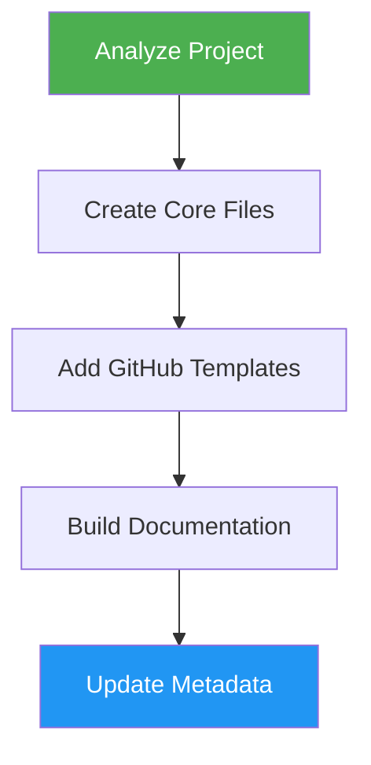

# OSS Ready

> Transform projects into professional open-source repositories with all standard community files.

## Highlights

- Generate README, CONTRIBUTING, LICENSE, Code of Conduct, and SECURITY files
- Create GitHub issue and PR templates
- Build documentation structure (ARCHITECTURE, DEVELOPMENT, DEPLOYMENT, CHANGELOG)
- Update project metadata (package.json, pyproject.toml, Cargo.toml)

## When to Use

| Say this... | Skill will... |
|---|---|
| "Make this open source" | Add all OSS standard files |
| "Setup OSS standards" | Generate community health files |
| "Add a license" | Create LICENSE and related docs |
| "Create contributing guide" | Write CONTRIBUTING.md and templates |

## How It Works



## Usage

```
/oss-ready
```

## Resources

| Path | Description |
|---|---|
| `assets/` | File templates and boilerplate content |

## Output

- Core files: README.md, CONTRIBUTING.md, LICENSE, CODE_OF_CONDUCT.md, SECURITY.md
- GitHub templates: bug report, feature request, pull request
- Documentation: ARCHITECTURE.md, DEVELOPMENT.md, DEPLOYMENT.md, CHANGELOG.md
- Updated project metadata and .gitignore
