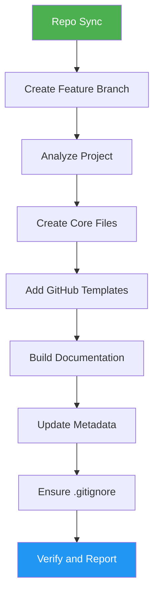

<!--
  DO NOT READ THIS FILE — This README.md is for human catalog browsing only.
  It ships inside the .skill package but is NEVER auto-loaded into agent context.
  The runtime loader only reads SKILL.md + references/ + scripts/ + agents/ when the skill triggers.
  If you're an AI agent, read the SKILL.md file instead for skill instructions.
-->

# OSS Ready

> Transform projects into professional open-source repositories with all standard community files.

## Highlights

- Generate README, CONTRIBUTING, LICENSE, Code of Conduct, and SECURITY files
- Create GitHub issue and PR templates
- Build documentation structure (ARCHITECTURE, DEVELOPMENT, DEPLOYMENT, CHANGELOG)
- Update project metadata (package.json, pyproject.toml, Cargo.toml) and .gitignore without overwriting existing values
- Fill license, conduct and security placeholders from the project and from you; never invent a contact
- Edit existing files additively: missing sections only, in the README's own language
- End with a short report: COMPLETE, PARTIAL or BLOCKED, the checks that ran, what is untested, and what you still need to do

## When to Use

| Say this... | Skill will... |
|---|---|
| "Make this open source" | Add all OSS standard files |
| "Setup OSS standards" | Generate community health files |
| "Add a license" | Create LICENSE and related docs |
| "Create contributing guide" | Write CONTRIBUTING.md and templates |

## How It Works



1. Sync the repo with `origin` (stash-first). It stops outside a git repository, on a detached HEAD, or when the sync fails, and asks before working without `origin`.
2. Create `feat/oss-ready` (or `feature/oss-ready`, following the repo's branches).
3. Detect the stack, the existing files and the values to fill in, and ask you for the security and conduct contacts.
4. Create the missing files from the bundled templates and add only missing sections to existing ones.
5. Run every acceptance check, a placeholder search and a deleted-file check. Nothing is committed or pushed.

## Installation

Install via [npx (Vercel)](https://www.npmjs.com/package/skills):

```bash
npx skills add https://github.com/luongnv89/skills --skill oss-ready
```

Or via [agent-skill-manager (asm)](https://www.npmjs.com/package/agent-skill-manager):

```bash
asm install github:luongnv89/skills:skills/oss-ready
```

## Usage

```
/oss-ready
```

## Resources

| Path | Description |
|---|---|
| `assets/LICENSE-MIT` | MIT license template |
| `assets/CODE_OF_CONDUCT.md` | Contributor Covenant 2.0 |
| `assets/SECURITY.md` | Security policy template |
| `assets/.github/ISSUE_TEMPLATE/bug_report.md` | Bug report issue template |
| `assets/.github/ISSUE_TEMPLATE/feature_request.md` | Feature request issue template |
| `assets/.github/PULL_REQUEST_TEMPLATE.md` | Pull request template |
| `references/repo-sync.md` | The Repo Sync block and what to do after it |
| `references/file-specs.md` | Analysis values, per-file content, placeholder fill values, metadata fields, `.gitignore` patterns |
| `references/final-report.md` | Final report parts, status rules, outcome table, examples, reader checks |
| `references/edge-cases.md` | Each edge case with detection, handling and status effect |
| `evals/evals.json` | Six eval cases: two happy-path, three edge, one negative-trigger |

## Output

- Core files: README.md, CONTRIBUTING.md, LICENSE, CODE_OF_CONDUCT.md, SECURITY.md
- GitHub templates: bug report, feature request, pull request
- Documentation: ARCHITECTURE.md, DEVELOPMENT.md, DEPLOYMENT.md, CHANGELOG.md
- Updated project metadata and .gitignore
- Uncommitted changes on a `feat/oss-ready` branch, for you to review and commit
- A final report in the chat: `Result:` (COMPLETE, PARTIAL or BLOCKED), `Evidence:`, `Uncertainty:` and `Decision:`
