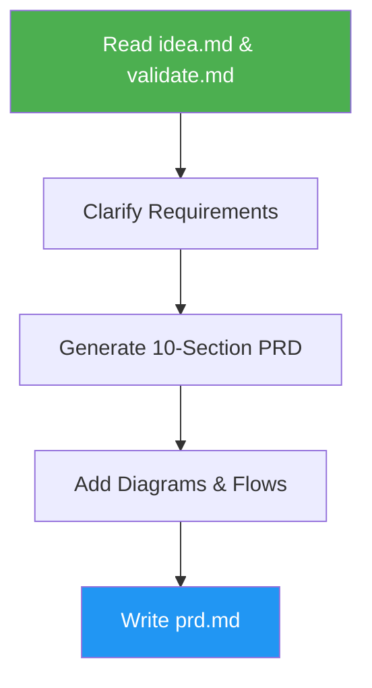

# PRD Generator

> Generate comprehensive Product Requirements Documents from validated idea files.

## Highlights

- Extract context from idea.md and validate.md automatically
- Create 10-section PRD with MoSCoW feature prioritization
- Include Mermaid diagrams for architecture and user flows
- Support modification mode with timestamped backups

## When to Use

| Say this... | Skill will... |
|---|---|
| "Create a PRD" | Generate full product requirements |
| "Write a PRD" | Build spec from validated idea |
| "Generate product requirements" | Transform idea into actionable PRD |

## How It Works



## Installation

Install via [npx (Vercel)](https://www.npmjs.com/package/skills):

```bash
npx skills add https://github.com/luongnv89/skills --skill prd-generator
```

Or via [agent-skill-manager (asm)](https://www.npmjs.com/package/agent-skill-manager):

```bash
asm install github:luongnv89/skills:skills/prd-generator
```

## Usage

```
/prd-generator
```

## Resources

| Path | Description |
|---|---|
| `references/` | PRD section templates and examples |

## Output

`prd.md` with Product Overview, User Personas, Feature Requirements, User Flows, Technical Specs, Analytics, Release Planning, Risks, and Appendix. Includes GitHub links to all changed files.
