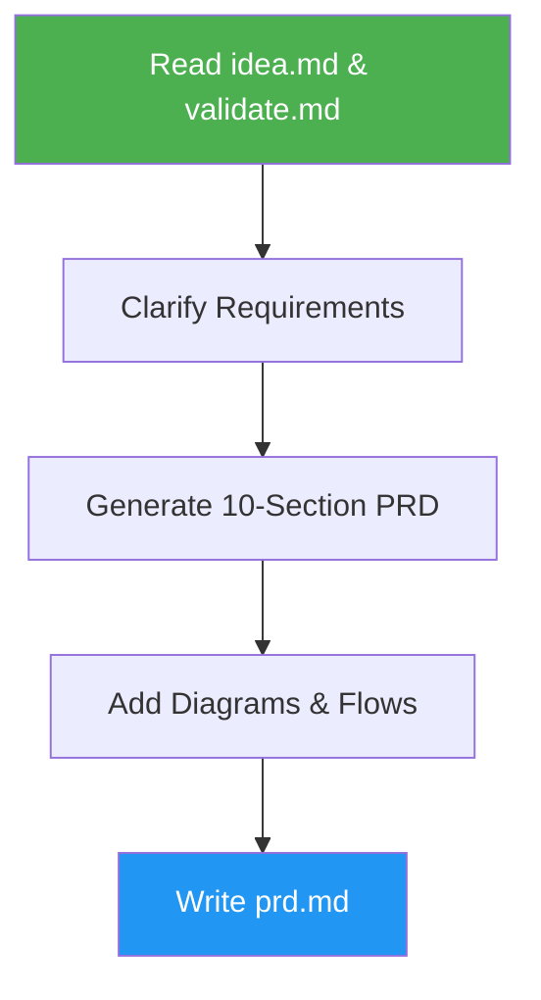

<!--
  DO NOT READ THIS FILE — This README.md is for human catalog browsing only.
  It ships inside the .skill package but is NEVER auto-loaded into agent context.
  The runtime loader only reads SKILL.md + references/ + scripts/ + agents/ when the skill triggers.
  If you're an AI agent, read the SKILL.md file instead for skill instructions.
-->

# PRD Generator

> Generate comprehensive Product Requirements Documents from validated idea files.

## Highlights

- Extract context from idea.md and validate.md automatically
- Create 10-section PRD with MoSCoW feature prioritization
- Include Mermaid diagrams for architecture and user flows
- Support modification mode with timestamped backups
- Verify the written PRD with grep-backed checks before reporting
- End every run with one short summary: status, evidence, open questions, and the next decision

## When to Use

| Say this... | Skill will... |
|---|---|
| "Create a PRD" | Generate full product requirements |
| "Write a PRD" | Build spec from validated idea |
| "Generate product requirements" | Transform idea into actionable PRD |

## How It Works



## Installation

Install via [npx (Vercel)](https://www.npmjs.com/package/skills):

```bash
npx skills add https://github.com/luongnv89/skills --skill prd-generator
```

Or via [agent-skill-manager (asm)](https://www.npmjs.com/package/agent-skill-manager):

```bash
asm install github:luongnv89/skills:skills/prd-generator
```

## Usage

```
/prd-generator
```

## Resources

| Path | Description |
|---|---|
| `references/prd-template.md` | Full 10-section PRD template |
| `references/expected-output.md` | Fixed `prd.md` skeleton reviewers can scan |
| `references/verification-steps.md` | Shell checks run after writing `prd.md` |
| `references/step-reports.md` | Per-phase Step Completion Report check names |
| `references/edge-cases.md` | Required behavior and final status for each edge case |
| `references/final-report.md` | Final Report examples, fill rules, and reader checks |
| `evals/evals.json` | 8 scenario cases (2 happy-path, 4 edge, 2 negative-trigger) |

## Output

`prd.md` with Product Overview, User Personas, Feature Requirements, User Flows, Non-Functional Requirements, Technical Specs, Analytics, Release Planning, Risks, and Appendix. In an ideas repo the skill also updates the README ideas index, commits by path, and pushes after you confirm. Every run ends with a Final Report: a `COMPLETE`, `PARTIAL` or `BLOCKED` status, the verification evidence and GitHub links, open questions and `TBD` values, and the decision waiting on you.
