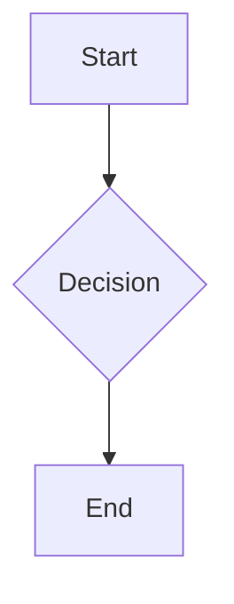

# Expected Output Skeleton

The generated `prd.md` MUST follow this skeleton (lengths vary, headings and formatting are fixed). Reviewers and graders can pattern-match on this structure.

```markdown
# Product Requirements Document: <Product Name>

> Source: idea.md, validate.md
> Generated: <YYYY-MM-DD>
> Version: 1.0

## 1. Product Overview
- Vision: <one sentence>
- Target users: <segment>
- Objectives: <bulleted>
- Success Metrics:
  - <Metric A>: target = <number + unit>, by <date/quarter>
  - <Metric B>: target = <number + unit>, by <date/quarter>
  - <Metric C>: target = <number + unit>, by <date/quarter>

## 2. User Personas
### Persona 1 — <Name>, <Role>
- Goals: ...
- Pain Points: ...
- Quote: "..."

## 3. Feature Requirements
| ID | Feature | Priority | User Story |
|----|---------|----------|------------|
| F1 | ...     | Must     | As a <user>, I want <goal> so that <benefit> |

#### F1 Acceptance Criteria
- Given <context>, When <action>, Then <outcome>.

## 4. User Flows


## 5. Non-Functional Requirements
- Performance: p95 latency < 300 ms; throughput >= 100 rps
- Security: OAuth2; data at rest encrypted (AES-256)
- Accessibility: WCAG 2.1 AA

## 6. Technical Specifications
... (architecture diagram + stack)

## 7. Analytics & Monitoring
... (events, dashboards, alerts)

## 8. Release Planning
- MVP (target: <date>): F1, F2, F3
- v1.1 (target: <date>): F4, F5

## 9. Open Questions & Risks
| Risk | Likelihood | Impact | Mitigation |
|------|------------|--------|------------|

## 10. Appendix
- Competitive analysis
- Glossary
- Revision history: v1.0 — initial PRD (<YYYY-MM-DD>)
```

## Expected console summary

```
prd.md written: /path/to/project/prd.md (XX KB, NN sections)
Sections: 10/10  ✓
Acceptance checklist: 13/13 ✓
Backup: prd.backup.20260101_120000.md (or skipped — no prior file)
Next: review §3 Feature Requirements with stakeholders
```
