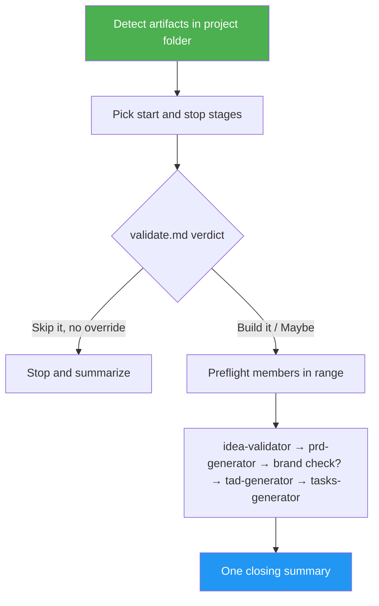

<!--
  DO NOT READ THIS FILE — This README.md is for human catalog browsing only.
  It ships inside the .skill package but is NEVER auto-loaded into agent context.
  The runtime loader only reads SKILL.md + references/ + scripts/ + agents/ when the skill triggers.
  If you're an AI agent, read the SKILL.md file instead for skill instructions.
-->

# Product Planner

> One invocation takes a product idea to a sprint task list by chaining idea-validator, prd-generator, tad-generator and tasks-generator.

Version: **1.0.0** · Author: Luong NGUYEN · License: MIT

## Highlights

- Chains four existing skills, unedited, through file handoffs: `idea.md` → `validate.md` → `prd.md` → `tad.md` → `tasks.md`.
- Resumes from the furthest artifact already in the project folder and never regenerates a file unless you ask.
- Stops wherever you say ("just validate + PRD"), and stops on a `Skip it` verdict unless you override it.
- Optional brand-name check once `prd.md` exists.
- Every member keeps its own questions and push confirmations; one summary lists every artifact and path.

## When to Use

| Say this... | Skill will... |
|---|---|
| "Take this idea all the way to a task list." | Run all four stages and summarize the five files |
| "Validate this idea and write the PRD, then stop." | Run idea-validator and prd-generator only |
| "Continue planning the project in ~/ideas/2026_10_01_foo." | Detect existing files and resume at the next missing stage |
| "Plan it end to end and check the name too." | Add brand-name-checker after the PRD |

For a single document, use the member skill directly (`/prd-generator`, `/tad-generator`, `/tasks-generator`, `/idea-validator`).

## How It Works



## Usage

```text
/product-planner A habit tracker for remote teams that nudges in Slack
/product-planner ~/ideas/2026_10_01_habit_tracker -- stop after the TAD
```

These are prompt examples, not CLI flags.

## Requirements

The member skills in the chosen range, installed via `asm`: `idea-validator`, `prd-generator`, `tad-generator`, `tasks-generator`, and optionally `brand-name-checker`. The skill checks only the ones your range needs and stops before writing anything if one is missing.

## Output

- The member files in the project folder: `idea.md`, `validate.md`, `prd.md`, `tad.md`, `tasks.md`.
- A closing summary with each artifact's status (generated, reused, skipped, not reached), absolute path, GitHub link and commit hash.

Note: idea-validator commits and pushes on its own; the other members ask before pushing.

## Resources

| Path | Description |
|---|---|
| `references/member-contracts.md` | Each member's inputs, outputs, gates, push behavior, and the summary template |
| `evals/` | Trigger and behavior cases, with resume and Skip-it fixtures |
