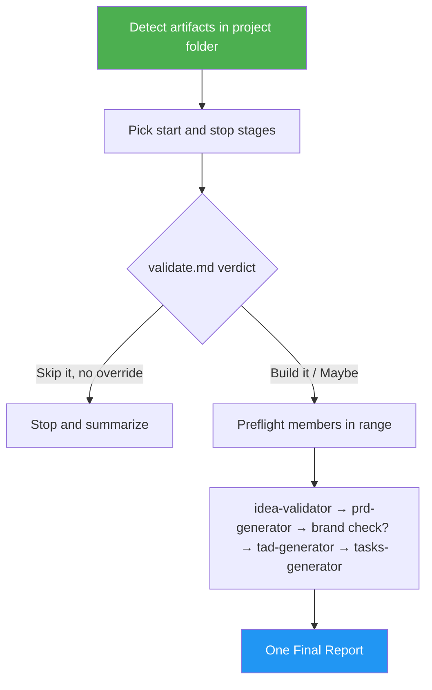

<!--
  DO NOT READ THIS FILE — This README.md is for human catalog browsing only.
  It ships inside the .skill package but is NEVER auto-loaded into agent context.
  The runtime loader only reads SKILL.md + references/ + scripts/ + agents/ when the skill triggers.
  If you're an AI agent, read the SKILL.md file instead for skill instructions.
-->

# Product Planner

> One invocation takes a product idea to a sprint task list by chaining idea-validator, prd-generator, tad-generator and tasks-generator.

Version: **1.1.0** · Author: Luong NGUYEN · License: MIT

## Highlights

- Chains four existing skills, unedited, through file handoffs: `idea.md` → `validate.md` → `prd.md` → `tad.md` → `tasks.md`.
- Resumes from the furthest artifact already in the project folder and never regenerates a file unless you ask.
- Stops wherever you say ("just validate + PRD"), and stops on a `Skip it` verdict unless you override it.
- Optional brand-name check once `prd.md` exists.
- Every member keeps its own questions and push confirmations; one Final Report lists every artifact, path, member result, link and commit hash, and opens with COMPLETE, PARTIAL or BLOCKED.

## When to Use

| Say this... | Skill will... |
|---|---|
| "Take this idea all the way to a task list." | Run all four stages and summarize the five files |
| "Validate this idea and write the PRD, then stop." | Run idea-validator and prd-generator only |
| "Continue planning the project in ~/ideas/2026_10_01_foo." | Detect existing files and resume at the next missing stage |
| "Plan it end to end and check the name too." | Add brand-name-checker after the PRD |

For a single document, use the member skill directly (`/prd-generator`, `/tad-generator`, `/tasks-generator`, `/idea-validator`).

## How It Works



## Usage

```text
/product-planner A habit tracker for remote teams that nudges in Slack
/product-planner ~/ideas/2026_10_01_habit_tracker -- stop after the TAD
```

These are prompt examples, not CLI flags.

## Requirements

The member skills in the chosen range: `idea-validator`, `prd-generator`, `tad-generator`, `tasks-generator`, and optionally `brand-name-checker`. They are declared in the frontmatter `dependencies` list. With `asm deps` available, the skill acquires the chain members in range for one session and releases it at the end; otherwise it checks the installed copies under `~/.claude/skills/` or `~/.agents/skills/`. It stops before anything is written if a chain member is missing; a missing brand checker only skips the brand check.

## Output

- The member files in the project folder: `idea.md`, `validate.md`, `prd.md`, `tad.md`, `tasks.md`.
- A Final Report: `Result:` (COMPLETE, PARTIAL or BLOCKED), then `Evidence:` with each artifact's status, absolute path, member result, and the GitHub link and commit hash copied from that member's own report, then `Uncertainty:`, `Decision:` and `Next step:`. A member's PARTIAL or BLOCKED result carries into the run's status.

Note: idea-validator commits and pushes on its own, and reuses a folder with today's date and the same name; the other members ask before pushing.

## Resources

| Path | Description |
|---|---|
| `references/member-contracts.md` | Each member's inputs, outputs, gates, push behavior and stop conditions |
| `references/final-report.md` | The Final Report template, two filled examples, fill rules and reader checks |
| `evals/evals.json` | Nine trigger and behavior cases (happy path, edge, negative trigger) |
| `evals/files/` | Fixtures: `resume-project`, `skip-verdict-project`, `maybe-rule-project` |
