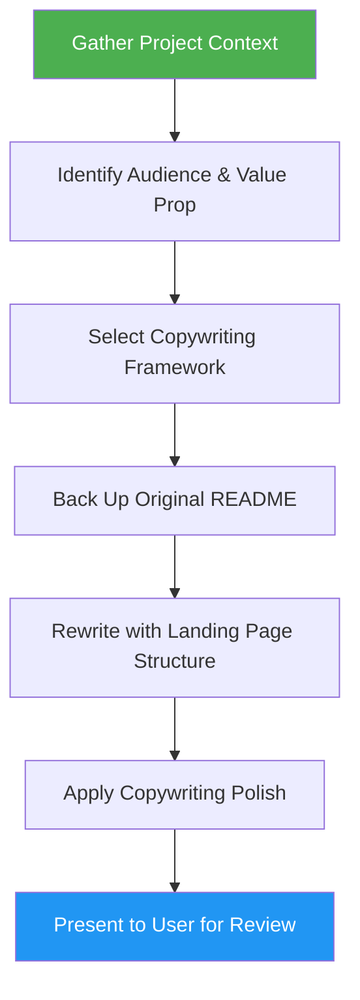

# README to Landing Page

> Transform any project README.md into a persuasive, landing-page-structured markdown that sells the project to visitors — using proven copywriting frameworks, all in pure GitHub-rendered markdown.

## Highlights

- Rewrites README.md using PAS, AIDA, or StoryBrand copywriting frameworks
- Creates hero section, problem/solution narrative, social proof, FAQ, and CTAs
- Preserves all original technical content in collapsible `<details>` sections
- Always backs up the original as `README.backup.md` before changes

## When to Use

| Say this... | Skill will... |
|---|---|
| "Turn my README into a landing page" | Rewrite README with landing page structure |
| "Make my README sell the project" | Apply copywriting frameworks to README |
| "Rewrite README as a landing page" | Transform from technical to persuasive |
| "Make my GitHub page more persuasive" | Optimize README for visitor conversion |

## How It Works



## Installation

Install via [npx (Vercel)](https://www.npmjs.com/package/skills):

```bash
npx skills add https://github.com/luongnv89/skills --skill readme-to-landing-page
```

Or via [agent-skill-manager (asm)](https://www.npmjs.com/package/agent-skill-manager):

```bash
asm install github:luongnv89/skills --skill readme-to-landing-page
```

## Usage

```
/readme-to-landing-page
```

## Output

- Rewritten `README.md` with landing-page section flow (hero, problem, solution, how it works, social proof, FAQ, CTA)
- `README.backup.md` — exact copy of the original README (always created)
- Original technical content preserved in collapsible `<details>` blocks
