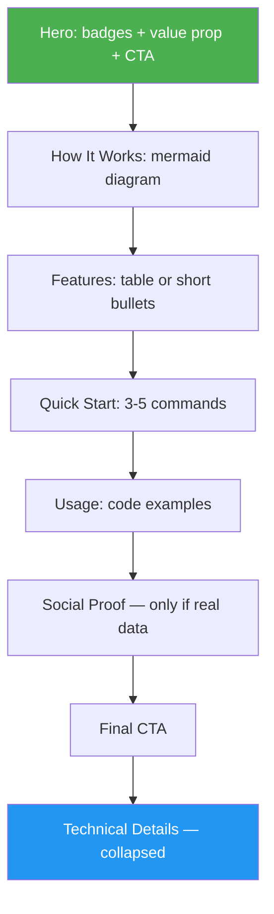

<!--
  DO NOT READ THIS FILE — This README.md is for human catalog browsing only.
  It ships inside the .skill package but is NEVER auto-loaded into agent context.
  The runtime loader only reads SKILL.md + references/ + scripts/ + agents/ when the skill triggers.
  If you're an AI agent, read the SKILL.md file instead for skill instructions.
-->

# README to Landing Page

> Transform any README.md into a concise, visual, developer-friendly landing page — diagrams over paragraphs, tables over lists, code over prose.

## Highlights

- Mermaid diagrams for architecture and workflows — visuals first, text second
- Anti-slop rules — bans filler phrases, rhetorical questions, empty adjectives
- No emoji — clean, professional output
- PAS, AIDA, or StoryBrand frameworks adapted for developer audiences
- All original technical content preserved in collapsible `<details>` sections

## When to Use

| Say this... | Skill will... |
|---|---|
| "Turn my README into a landing page" | Rewrite with visual-first landing page structure |
| "Make my README sell the project" | Apply copywriting framework with mermaid diagrams |
| "Make my GitHub page more persuasive" | Optimize for developer conversion |

## How It Works


## Output Structure



## Installation

```bash
npx skills add https://github.com/luongnv89/skills --skill readme-to-landing-page
```

## Usage

```
/readme-to-landing-page
```

## Output

- Rewritten `README.md` — visual-first, scannable, mermaid-driven, zero slop
- `README.backup.md` — exact copy of original
- Original technical content in collapsible `<details>` blocks
