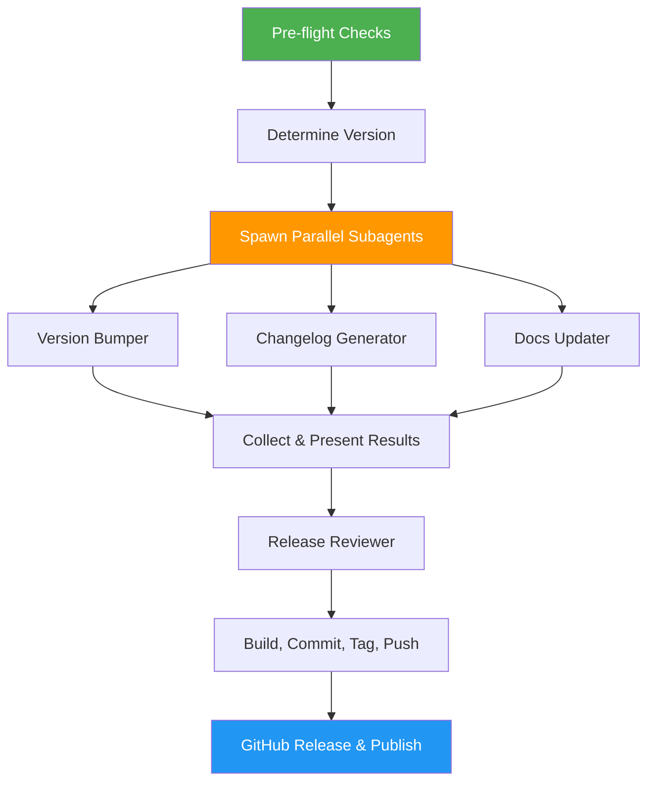

# Release Manager

> Complete release automation — version bumps, changelog, README updates, documentation sync, builds, git tags, GitHub releases, and publishing to PyPI/npm.

## Highlights

- Subagent architecture: heavy work (scanning, changelog, docs) runs in parallel via isolated subagents
- Analyze commits to suggest the right semver bump (major/minor/patch)
- Bump version numbers across all project files automatically
- Generate categorized changelog from git history and GitHub PRs
- Independent quality review of all release changes before commit
- Create git tags, push, and publish GitHub Releases with artifacts
- Publish to PyPI and/or npm registries
- Detect and defer to existing release tools (semantic-release, changesets, etc.)
- Graceful degradation: works without Agent tool (inline execution on Claude.ai)

## When to Use

| Say this... | Skill will... |
|---|---|
| "Prepare a release" | Run the full release workflow end-to-end |
| "Bump the version" | Analyze changes, suggest version, update all files |
| "Generate release notes" | Create categorized changelog from git history |
| "Cut a release for v2.0" | Execute all release steps for the specified version |
| "What changed since last release?" | Summarize commits and PRs since last tag |
| "Tag and publish a release" | Commit, tag, push, and create GitHub Release |
| "Publish to PyPI" | Build and upload Python package to PyPI |
| "Publish to npm" | Pack and publish Node.js package to npm |
| "Update all docs for the release" | Sync documentation with release changes |

## How It Works



## Installation

Install via [npx (Vercel)](https://www.npmjs.com/package/skills):

```bash
npx skills add https://github.com/luongnv89/skills --skill release-manager
```

Or via [agent-skill-manager (asm)](https://www.npmjs.com/package/agent-skill-manager):

```bash
asm install github:luongnv89/skills:skills/release-manager
```

## Usage

```
/release-manager
```

## Resources

| Path | Description |
|---|---|
| `agents/` | Subagent prompts: version-bumper, changelog-generator, docs-updater, release-reviewer |
| `references/` | Publishing workflows for PyPI and npm |

## Output

- Updated version numbers across all project files
- `CHANGELOG.md` with categorized changes
- Updated `README.md` with version info
- Independent quality review of all changes
- Git commit tagged with the new version
- GitHub Release with release notes and optional build artifacts
- Synced project documentation (API docs, guides, migration notes)
- Published package on PyPI and/or npm (if applicable)
- Post-release checklist for follow-up tasks
