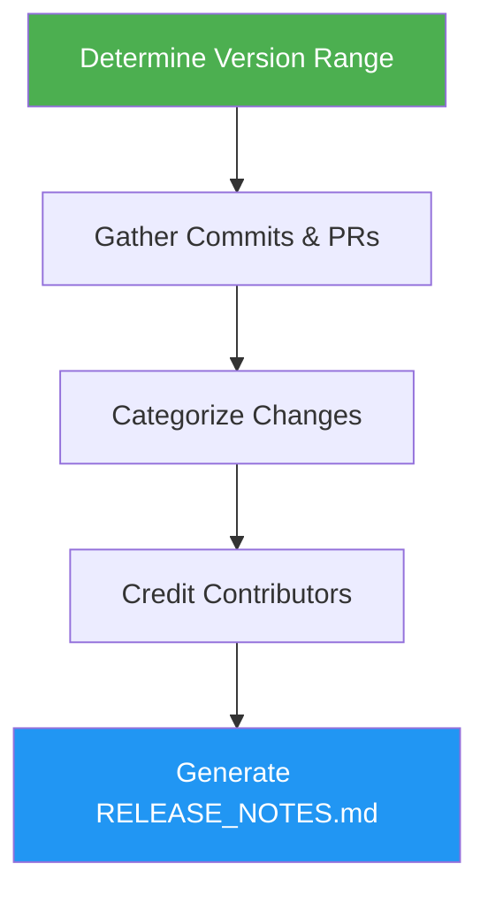

# Release Notes

> Generate comprehensive release notes by analyzing git history and GitHub activity.

## Highlights

- Analyze git commits and GitHub PRs/issues for the version range
- Categorize changes: features, bug fixes, performance, docs, breaking changes
- Credit contributors with @mentions and highlight new contributors
- Optionally publish as a GitHub Release

## When to Use

| Say this... | Skill will... |
|---|---|
| "Create release notes" | Generate notes for a version range |
| "Generate changelog" | Summarize all changes since last release |
| "Prepare release" | Build release notes and optionally publish |
| "What changed since last release?" | List categorized changes |

## How It Works



## Usage

```
/release-notes
```

## Output

`RELEASE_NOTES.md` with sections for Breaking Changes, Features, Bug Fixes, Performance, Documentation, Other Changes, New Contributors, and a full changelog comparison link.
