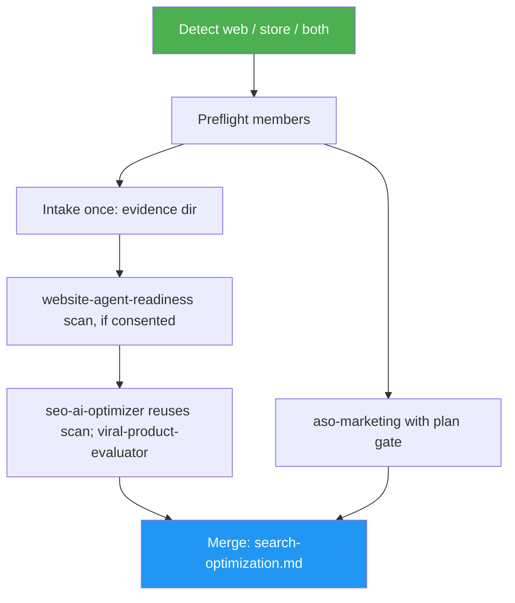

<!--
  DO NOT READ THIS FILE — This README.md is for human catalog browsing only.
  It ships inside the .skill package but is NEVER auto-loaded into agent context.
  The runtime loader only reads SKILL.md + references/ + scripts/ + agents/ when the skill triggers.
  If you're an AI agent, read the SKILL.md file instead for skill instructions.
-->

# Search Optimizer

> One run to optimize a website or app for SEO, AI-bot search and app-store search, with one merged report.

Version: **1.0.0** · Author: Luong NGUYEN · License: MIT

## Highlights

- Detects the target: website (URL or codebase), app store (Info.plist, build.gradle, fastlane, listing), or both.
- Web: `seo-ai-optimizer`, `website-agent-readiness` and `viral-product-evaluator` share one evidence capture and a check-ownership matrix; `seo-ai-optimizer` owns crawler directives (audit and fix).
- The agent-readiness scan runs once; `seo-ai-optimizer` reuses it instead of scanning again.
- Store: `aso-marketing` with its plan-approval gate, plus `viral-product-evaluator` (run once even when both branches run).
- One deduplicated `search-optimization.md`. Every write stays inside a member's approval gate.

## When to Use

| Say this... | Skill will... |
|---|---|
| "Optimize my site for SEO and AI search." | Capture once, run the web members, merge one report |
| "Improve search for our website and our iOS app." | Run web and store branches, one merged report |
| "Make our Play Store app easier to find." | Run aso-marketing and viral-product-evaluator, merge |

For a single fix use the member directly: `seo-ai-optimizer` (robots.txt, meta tags, llms.txt), `aso-marketing` (store keywords), `website-agent-readiness` (scan only).

## How It Works



## Usage

```text
/search-optimizer https://example.com
/search-optimizer /path/to/repo
```

## Output

- `evidence/manifest.json` (web) with captured files and check owners
- `reports/<member>/` — each member's own report
- `search-optimization.md` — the single merged, prioritized report

## Requirements

Web branch: `seo-ai-optimizer` required; `website-agent-readiness`, `viral-product-evaluator` optional. Store branch: `aso-marketing` required; `viral-product-evaluator` optional.

```bash
asm install github:luongnv89/skills:skills/search-optimizer -p claude --yes
```
