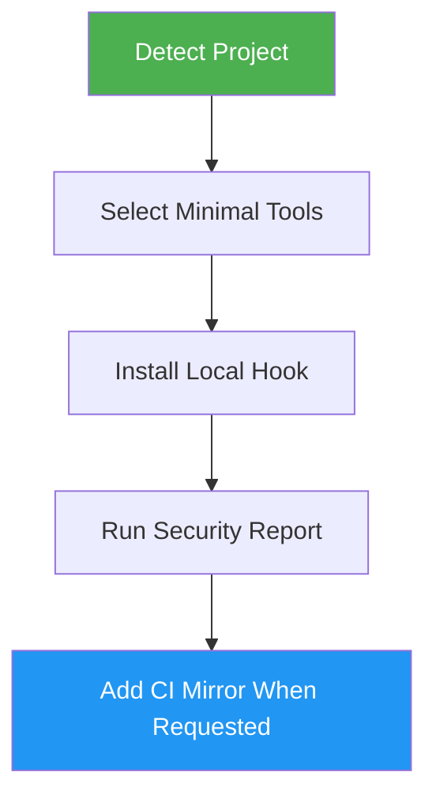

<!--
  DO NOT READ THIS FILE - This README.md is for human catalog browsing only.
  It ships inside the .skill package but is NEVER auto-loaded into agent context.
  The runtime loader only reads SKILL.md + references/ + scripts/ + agents/ when the skill triggers.
  If you're an AI agent, read the SKILL.md file instead for skill instructions.
-->

# Security Setup

> Add local-first security hardening with pre-commit hooks, offline scanner runtime, reports, and optional free-tier CI.

## Highlights

- Detect project language and choose the smallest useful security tool set
- Add pre-commit checks for secrets, dependencies, and static analysis
- Run hooks offline using local rules and warmed vulnerability databases
- Print JSON, Markdown, and terminal summary reports with severity counts
- Gate CI workflow creation until local Phase 1 checks are installed and passing

## When to Use

| Say this... | Skill will... |
|---|---|
| "Add security pre-commit hooks" | Install local checks for secrets, dependencies, and static analysis |
| "Harden this repo before pushing" | Configure offline-first security checks and reports |
| "Scan for leaked credentials locally" | Add gitleaks or detect-secrets through pre-commit |
| "Add free security CI too" | Generate GitHub Actions only after local checks pass |

## How It Works



## Usage

```
/security-setup
/security-setup --ci
```

## Resources

| Path | Description |
|---|---|
| `references/tool-selection.md` | Offline-first scanner selection and install guidance |
| `references/templates.md` | Target repository file templates |
| `scripts/security_check.py` | Copyable local security summary runner |

## Output

- `.pre-commit-config.yaml` security hook merged into the target repo
- `scripts/security_check.py` local runner
- `security/security-tools.json` and `security/semgrep-rules.yml`
- `SECURITY.md` summary of selected tools, gaps, run commands, and bypass policy
- Optional `.github/workflows/security.yml` when `--ci` is requested
