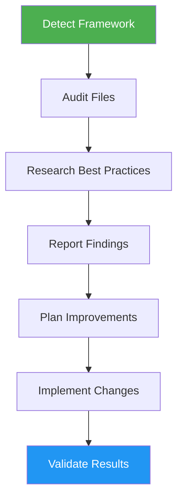

# SEO & AI Bot Optimizer

> Audit and optimize website codebases for search engines and AI discovery systems.

## Highlights

- Detect project framework (Next.js, Nuxt, Astro, Hugo, SvelteKit, etc.)
- Run automated scans across 4 categories with severity-based reporting
- Research latest SEO and AI bot best practices via web search
- Handle large codebases by sampling representative files

## When to Use

| Say this... | Skill will... |
|---|---|
| "Optimize for SEO" | Run full audit and apply fixes |
| "Audit SEO" | Scan for issues without modifying |
| "Add structured data" | Implement schema.org markup |
| "Optimize for AI bots" | Add llms.txt and AI-friendly metadata |

## How It Works



## Installation

Install via [npx (Vercel)](https://www.npmjs.com/package/skills):

```bash
npx skills add https://github.com/luongnv89/skills --skill seo-ai-optimizer
```

Or via [agent-skill-manager (asm)](https://www.npmjs.com/package/agent-skill-manager):

```bash
asm install github:luongnv89/skills:skills/seo-ai-optimizer
```

## Usage

```
/seo-ai-optimizer
```

## Resources

| Path | Description |
|---|---|
| `agents/auditor.md` | Scan codebase and generate comprehensive SEO & AI bot audit report |
| `agents/researcher.md` | Identify framework-specific best practices and improvement opportunities |
| `agents/implementer.md` | Apply SEO fixes (meta tags, robots.txt, llms.txt, structured data, sitemaps) |
| `agents/validator.md` | Validate fixes and confirm improvements in generated report |
| `references/` | Framework-specific configs and SEO checklists |
| `scripts/` | Automated scanning and validation scripts |

## Output

- SEO & AI Bot Audit Report with Critical/Warning/Info findings
- Prioritized improvement plan with implementation checklist
- Applied fixes: meta tags, robots.txt, llms.txt, structured data, sitemaps
- Validation results confirming improvements
