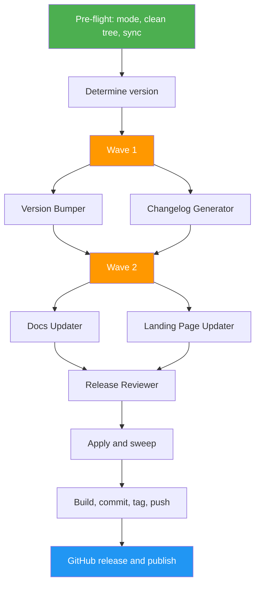

<!--
  DO NOT READ THIS FILE — This README.md is for human catalog browsing only.
  It ships inside the .skill package but is NEVER auto-loaded into agent context.
  The runtime loader only reads SKILL.md + references/ + scripts/ + agents/ when the skill triggers.
  If you're an AI agent, read the SKILL.md file instead for skill instructions.
-->

# Ship

> Release a project end to end, autonomous by default: bump the version everywhere, write the changelog and end-user release notes, refresh the README, docs, and landing page, then tag, push, create the GitHub release, and publish to PyPI/npm. Formerly `release-manager`.

## Highlights

- **Auto mode by default**: `/ship` runs every step without asking. Each gate has a fixed outcome (continue, skip with `PARTIAL`, or stop with `BLOCKED`), and every decision is listed in the final report
- **`--no-auto`** restores step-by-step confirmation for the version, file changes, build, push, GitHub release, and publish
- **Version bumped in every place**: version sources are found by field (manifests, lockfiles, plugin manifests, app versions, constants), even when they drifted, then a sweep proves no stale version remains
- **End-user release notes** in plain language, separate from the developer changelog
- **Landing page coverage**: version, end-user changelog, feature list, and documentation, each reported as updated, current, or not on page
- Promotes an existing `## Unreleased` changelog section instead of duplicating it
- Two-wave subagents: version and changelog first, then docs and landing page built on their results
- Independent review of every proposal before any file is written
- Guardrails instead of prompts: auto mode releases only from the default branch with a clean tree, checks tags and registries before changing any file, reads `BREAKING CHANGE:` footers, and never force-pushes, skips hooks, or rolls back on its own
- Safe auto publishing: only to registries where this project already publishes, never a pre-release or older-line version as `latest`, never a duplicate of a CI-owned publish
- Hands over to existing release tools (semantic-release, changesets, release-it) and monorepos instead of running them unattended
- Resumes a stopped release from where it left off
- Works without the Agent tool (inline execution on Claude.ai)

## When to Use

| Say this... | Skill will... |
|---|---|
| "/ship" | Run the full release end to end in auto mode |
| "/ship 2.0.0" or "/ship minor" | Release that exact version, or apply that bump |
| "/ship --no-auto" or "Ship it, but ask me before each step" | Run the full release with confirmations |
| "Cut a release" / "Tag and publish v1.4" | Run the full release |
| "What changed since the last release?" | Summarize commits and draft notes; change no files |
| "Bump the version" | Update every version place and the docs; leave the changes uncommitted |
| "Update the landing page for the release" | Refresh version, what's new, features, and docs on the landing page; no commit |
| "Publish to PyPI" / "Publish to npm" | Run the release and publish to that registry, including a first publish |

## How It Works



## Installation

Install via [npx (Vercel)](https://www.npmjs.com/package/skills):

```bash
npx skills add https://github.com/luongnv89/skills --skill ship
```

Or via [agent-skill-manager (asm)](https://www.npmjs.com/package/agent-skill-manager):

```bash
asm install github:luongnv89/skills:skills/ship
```

Upgrading from `release-manager`: install `ship`, then remove the old installed `release-manager` copy so both names do not compete for the same requests.

## Usage

```
/ship [X.Y.Z | major | minor | patch] [--auto | --no-auto]
```

## Resources

| Path | Description |
|---|---|
| `agents/` | Subagent prompts: version-bumper, changelog-generator, docs-updater, landing-page-updater, release-reviewer |
| `references/` | Auto-mode outcomes, orchestration, step reports, final report, and PyPI/npm publishing |

## Output

- The new version in every place the project states it, with a sweep result showing no stale version left
- `CHANGELOG.md` entry for the release, plus GitHub release notes
- Plain-language end-user notes, used for the landing page's "What's new"
- Updated README and docs for the release's features and breaking changes
- Landing page refreshed across version, end-user changelog, feature list, and documentation, when the project has one
- Independent review of all proposals before any file is written
- Annotated git tag pushed to origin, and a GitHub release
- Published package on PyPI and/or npm, when the project publishes there
- Final report that opens with the result (`COMPLETE`, `PARTIAL`, or `BLOCKED`) and the mode, then the checks that ran, what was not verified, and any decision still waiting on you
- Post-release checklist for follow-up tasks
