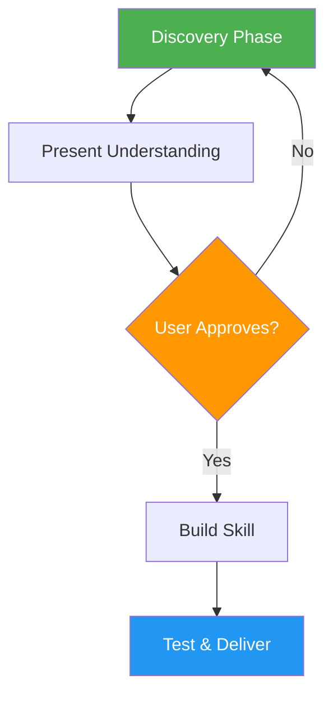

# Skill Creator

> Interactive, guided skill creation following Anthropic's best practices with a 4-phase workflow.

## Highlights

- Discovery phase to understand purpose, requirements, and edge cases
- Approval gate before building to confirm understanding
- Generate YAML frontmatter, SKILL.md, README.md, and supporting resources
- Include test suite with trigger and functional test cases

## When to Use

| Say this... | Skill will... |
|---|---|
| "Create a new skill" | Start guided skill creation |
| "Build a skill for X" | Design and build from requirements |
| "Update an existing skill" | Modify with diff-style summary |
| "Help me make a skill" | Walk through the 4-phase process |

## How It Works



## Usage

```
/skill-creator
```

## Resources

| Path | Description |
|---|---|
| `references/` | Skill structure guidelines and best practices |
| `scripts/` | Validation and packaging scripts |

## Output

- Complete skill folder with SKILL.md (YAML frontmatter + instructions) and README.md (human-readable docs)
- Supporting resources in `scripts/`, `references/`, `assets/` as needed
- Packaged `.skill` file for distribution
- Test suite with trigger and functional tests

## Acknowledgement

Customized from Anthropic's official [skill-creator](https://github.com/anthropics/claude-code/tree/main/plugins/skill-creator) skill. Added README.md generation step and adapted for this skill collection.
