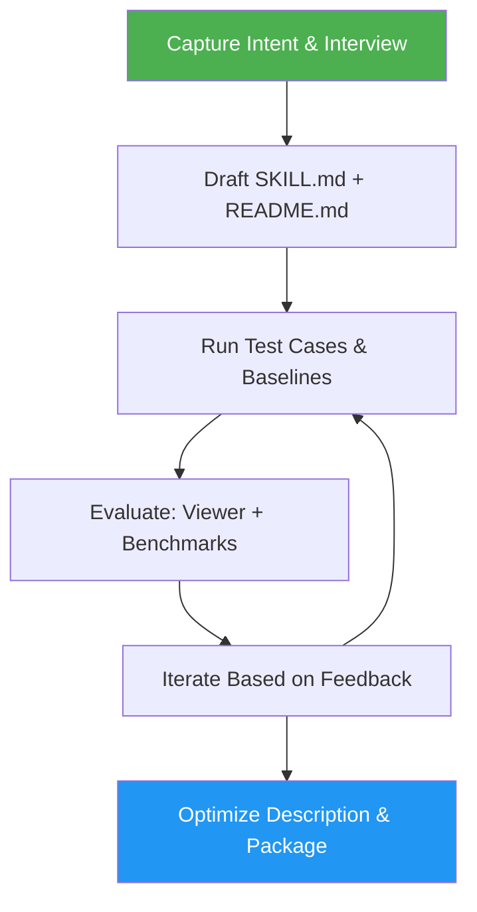

# Skill Creator

> Create, evaluate, benchmark, and iteratively improve agent skills.

## Highlights

- Iterative skill loop: draft, test prompts, evaluate, refine
- Quantitative + qualitative eval workflow with baseline comparison
- Benchmark aggregation, variance analysis, and report tooling
- Description optimization flow to improve triggering accuracy
- Dedicated eval viewer and grading agents for structured review

## When to Use

| Say this... | Skill will... |
|---|---|
| "Create a skill for X" | Interview you, draft SKILL.md + README.md, run test cases |
| "Improve this skill" | Run evals, collect feedback, iterate on the skill |
| "Run evals for my skill" | Execute test prompts, grade results, show benchmark |
| "Optimize skill triggering" | Generate trigger eval queries, run optimization loop |

## How It Works



## Installation

Install via [npx (Vercel)](https://www.npmjs.com/package/skills):

```bash
npx skills add https://github.com/luongnv89/skills --skill skill-creator
```

Or via [agent-skill-manager (asm)](https://www.npmjs.com/package/agent-skill-manager):

```bash
asm install github:luongnv89/skills:skills/skill-creator
```

## Usage

```
/skill-creator
```

## Resources

| Path | Description |
|---|---|
| `scripts/` | Eval loop, benchmarking, packaging, validation utilities |
| `references/` | Evals schema reference |
| `eval-viewer/` | Generate/view review pages for eval results |
| `agents/` | Analyzer, comparator, and grader agent prompts |
| `assets/` | Viewer template assets |

## Output

Produces complete skill packages (SKILL.md + README.md), eval results with benchmark reports, and optimized skill descriptions for accurate triggering.
