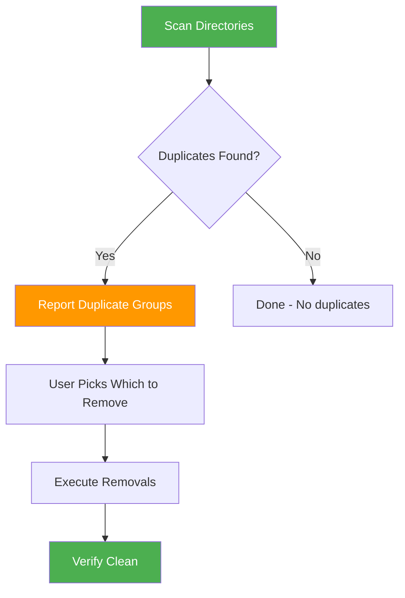

# Skill Inventory Auditor

> Find and remove duplicate skills across installed skill directories.

## Highlights

- Scans global (`~/.claude/skills/`, `~/.agents/skills/`) and project-local (`.claude/skills/`) directories
- Detects duplicate skills using name matching and description similarity analysis
- Distinguishes symlink shared installations from true duplicates
- Interactive cleanup workflow with confirmation before removals

## When to Use

| Say this... | Skill will... |
|---|---|
| "Check for duplicate skills" | Find and list duplicate/overlapping skills |
| "Deduplicate skills" | Find duplicates and help remove them |
| "Clean up skills" | Interactive removal of duplicate skills |
| "Audit my skills" | Scan all scopes for duplicates |

## How It Works



## Usage

```
/skill-inventory-auditor
```

## Resources

| Path | Description |
|---|---|
| `scripts/scan_inventory.py` | Python scanner — extracts metadata and detects duplicates via name + description similarity |

## Output

- Duplicate groups with similarity scores and keep/remove recommendations
- Symlink shared installation summary (these are NOT flagged as duplicates)
- Cleanup actions with confirmation and verification
