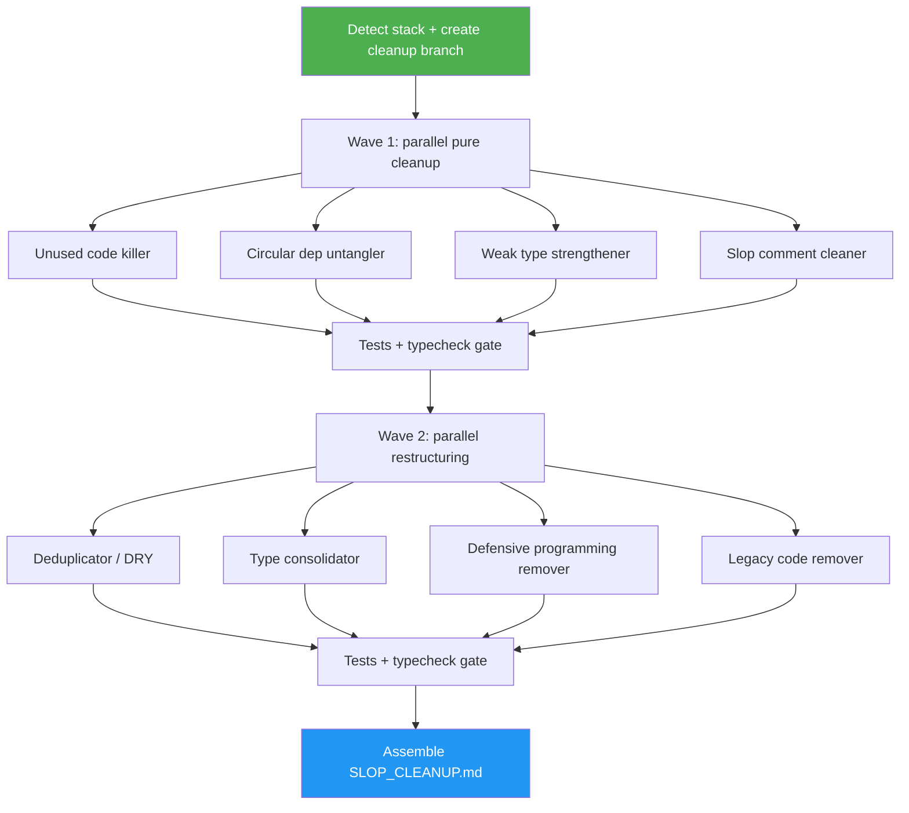

# Slop Code Cleanup

> Aggressively clean up a codebase by eliminating duplication, weak types, dead code, over-defensive error handling, legacy paths, and AI slop comments — via 8 specialized subagents running in parallel.

## Highlights

- **8 focused subagents**, each owning one cleanup category, so work stays deep and auditable
- **Two-wave dispatch** — pure-cleanup agents run first, structural restructuring follows, tests gate between
- **Per-category commits** on a dedicated cleanup branch, so any category can be reverted independently
- **Safety gates** — refuses to run on a dirty tree, creates a cleanup branch, runs tests between waves
- **Stack-aware tooling** — uses knip, madge, ts-prune, vulture, staticcheck, etc. based on the detected language, falls back to grep when tools aren't installed
- **Final report** at `SLOP_CLEANUP.md` with all deletions, merges, and flags for user review

## When to Use

| Say this... | Skill will... |
|---|---|
| "clean up the codebase" | Run the full 8-subagent pipeline on a fresh branch |
| "remove AI slop" | Dispatch the slop-comment cleaner, type strengthener, and defensive-programming remover |
| "kill dead code" / "remove unused code" | Run the unused-code killer with stack-specific tools |
| "tighten the types" | Run the weak-type strengthener and type consolidator |
| "untangle dependencies" | Run the circular-dependency untangler |
| "DRY up this codebase" | Run the deduplicator with payoff-ranked candidates |
| "remove legacy and deprecated code" | Run the legacy-code remover with user-review flags |

## How It Works



## Usage

```
/slop-code
```

Works best on a clean working tree. The skill creates its own branch (`chore/slop-cleanup-YYYYMMDD`) before any edits, commits one category at a time, and runs tests between waves.

## Resources

| Path | Description |
|---|---|
| `agents/deduplicator.md` | Wave 2 — find duplication, apply DRY only when it reduces complexity |
| `agents/type-consolidator.md` | Wave 2 — consolidate shared type/interface/struct definitions |
| `agents/unused-code-killer.md` | Wave 1 — delete unreferenced code (knip, ts-prune, vulture, staticcheck) |
| `agents/circular-dep-untangler.md` | Wave 1 — break import cycles (madge, dependency-cruiser) |
| `agents/weak-type-strengthener.md` | Wave 1 — replace any/unknown/interface{} with researched strong types |
| `agents/defensive-programming-remover.md` | Wave 2 — remove bug-hiding try/catch and silent fallbacks |
| `agents/legacy-code-remover.md` | Wave 2 — delete deprecated, fallback, and migration-shim code |
| `agents/slop-comment-cleaner.md` | Wave 1 — remove AI slop, stubs, work-in-motion narration |

## Output

- A dedicated branch `chore/slop-cleanup-YYYYMMDD` with one commit per cleanup category
- `SLOP_CLEANUP.md` at the repo root summarizing all changes, stats, risk flags, and items needing user review
- Per-subagent reports under `.slop-cleanup/wave-{1,2}/<subagent>.md`
- Tests and typecheck passing on the branch — if they don't, the pipeline stops and surfaces the failure
