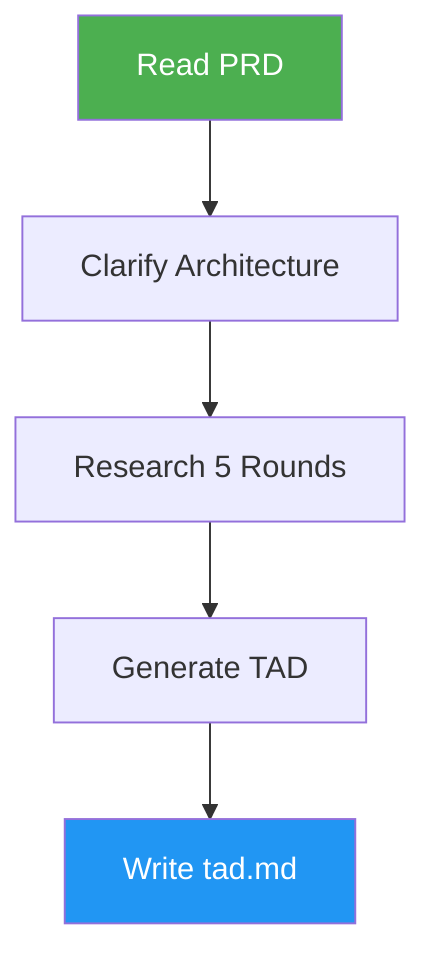

# System Design

> Generate Technical Architecture Documents (TAD) from PRD files with modular, startup-appropriate design.

## Highlights

- Extract requirements from PRD and conduct 5 research rounds
- Cover tech stack, infrastructure, security, risks, and holistic review
- Generate Mermaid architecture diagrams and cost estimates
- Support modification mode with versioned backups

## When to Use

| Say this... | Skill will... |
|---|---|
| "Design the architecture" | Generate TAD from existing PRD |
| "Create a TAD" | Build technical architecture document |
| "System design" | Plan infrastructure and components |
| "Define how this will be built" | Research and document architecture |

## How It Works



## Installation

Install via [npx (Vercel)](https://www.npmjs.com/package/skills):

```bash
npx skills add https://github.com/luongnv89/skills --skill system-design
```

Or via [agent-skill-manager (asm)](https://www.npmjs.com/package/agent-skill-manager):

```bash
asm install github:luongnv89/skills --skill system-design
```

## Usage

```
/system-design
```

## Resources

| Path | Description |
|---|---|
| `references/tad-template.md` | Technical Architecture Document template |
| `references/tech-stack.md` | Technology stack patterns and research guide |

## Output

`tad.md` with System Overview, Architecture Diagram, Tech Stack, System Components, Data Architecture, Infrastructure, Security, Performance, Development Setup, Risk Matrix, and Appendix. Includes cost estimates and GitHub links.
