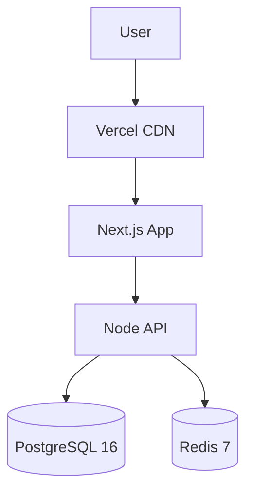

# TAD Generator

Generate comprehensive Technical Architecture Documents with modular design for startups.

## Subagent Architecture

This skill uses parallel research agents with upfront content extraction. **Pattern**: D (Research+Synthesis) + E (Staged Pipeline).

### Agents

| Agent | Role | Parallelization |
|-------|------|-----------------|
| **prd-reader** | Read PRD + supporting docs, return structured extraction | Sequential (only once) |
| **tech-researcher** | Handle one research round (spawned 5x in parallel) | Parallel (5 instances) |
| **tad-writer** | Generate complete tad.md from all inputs | Sequential (after all research) |

### Research Rounds (5 Parallel)

- **Round 1**: Technology Stack validation (React, Node.js, PostgreSQL, Elasticsearch)
- **Round 2**: Infrastructure validation (Vercel, AWS, CDN, cost estimation)
- **Round 3**: Security review (auth, encryption, compliance, API security)
- **Round 4**: Risk assessment (bottlenecks, vendor lock-in, team gaps)
- **Round 5**: Holistic review (PRD alignment, team capability, quick wins)

### Parallelization Strategy

- **PRD Content**: Extracted once by prd-reader, stays out of main context
- **Research Independence**: Each round researches conceptually different angle (tech vs. infra vs. security)
- **Reasoning Isolation**: Parallel rounds keep each area's reasoning isolated, prevent groupthink
- **Note**: Research rounds are conceptual reasoning, not data fetching — parallel rounds won't produce fundamentally different info, but isolation improves quality

**Result**: All 5 rounds complete concurrently, tad-writer synthesizes outputs into unified TAD.

## Environment Check

Before executing:
1. Verify prd.md exists in project directory
2. Check for supporting docs (idea.md, validate.md) if available
3. Confirm WebSearch and WebFetch tools available for research
4. Verify write permissions to project root for tad.md creation
5. Ensure git access for final commit

## Repo Sync Before Edits (mandatory)
Before creating/updating/deleting files in an existing repository, sync the current branch with remote:

```bash
branch="$(git rev-parse --abbrev-ref HEAD)"
git fetch origin
git pull --rebase origin "$branch"
```

If the working tree is not clean, stash first, sync, then restore:

```bash
git stash push -u -m "pre-sync"
branch="$(git rev-parse --abbrev-ref HEAD)"
git fetch origin && git pull --rebase origin "$branch"
git stash pop
```

If `origin` is missing, pull is unavailable, or rebase/stash conflicts occur, stop and ask the user before continuing.

## Input

Project folder path in `$ARGUMENTS` containing:
- `prd.md` - Product requirements (required)
- `idea.md`, `validate.md` - Additional context (optional)

## Workflow

### Phase 1: Setup & Validation

1. Verify `prd.md` exists
2. Read supporting docs if present
3. Read [references/tech-stack.md](references/tech-stack.md) for technology recommendations
4. Backup existing `tad.md` if present

### Phase 2: Extract Context

From PRD extract:
- Product name and vision
- Core features and requirements
- User flows
- Non-functional requirements
- Third-party integrations
- Analytics requirements

### Phase 3: Clarify Architecture

Ask user (if not clear):

| Decision | Options |
|----------|---------|
| Deployment | Vercel/Netlify (recommended), AWS, GCP, Self-hosted |
| Database | PostgreSQL, MongoDB, Supabase/Firebase, Multiple |
| Auth | Social (OAuth), Email/password, Magic links, Enterprise SSO |
| Budget | Free tier, <$50/mo, <$200/mo, Flexible |

### Phase 4: Research & Validation

Conduct 5 research rounds:
1. **Technology Stack**: Validate choices against industry standards
2. **Infrastructure**: Compare hosting for cost and scalability
3. **Security**: Review OWASP guidelines for chosen stack
4. **Risk Assessment**: Identify bottlenecks, vendor lock-in
5. **Holistic Review**: Ensure PRD alignment and startup feasibility

### Phase 5: Generate TAD

Create `tad.md` with sections:

1. **System Overview** - Purpose, scope, PRD alignment
2. **Architecture Diagram** - Mermaid diagrams for system and flows
3. **Technology Stack** - Frontend, backend, database, infrastructure, DevOps
4. **System Components** - Modular design with interfaces and dependencies
5. **Data Architecture** - Schema, models, flows, storage
6. **Infrastructure** - Hosting, environments, scaling, CI/CD, monitoring
7. **Security** - Auth, authorization, data protection, API security
8. **Performance** - Targets, optimization strategies, caching
9. **Development** - Environment setup, project structure, testing, deployment
10. **Risks** - Risk matrix with mitigations
11. **Appendix** - Research insights, alternatives, costs, glossary

See [references/tad-template.md](references/tad-template.md) for full template structure.

### Phase 6: README Maintenance (ideas repo)

After writing `tad.md`, if the project folder is inside an `ideas` repo, update the repo README ideas table:
- Preferred: `cd` to repo root and run `python3 scripts/update_readme_ideas_index.py` (if it exists)
- Fallback: update `README.md` manually (ensure TAD status becomes ✅ for that idea)

### Phase 7: Commit and push (mandatory)

- Commit immediately after updates.
- Push immediately to remote.
- If push is rejected: `git fetch origin && git rebase origin/main && git push`.

Do not ask for additional push permission once this skill is invoked.

### Phase 8: Output

1. Write `tad.md` to project folder
2. Summarize architecture decisions
3. Highlight modular design benefits
4. List cost estimates by phase
5. Suggest next steps (setup dev environment, create tasks)

## Reporting with GitHub links (mandatory)
When reporting completion, include:
- GitHub link to `tad.md`
- GitHub link to `README.md` when it was updated
- Commit hash

Link format (derive `<owner>/<repo>` from `git remote get-url origin`):
- `https://github.com/<owner>/<repo>/blob/main/<relative-path>`

## Step Completion Reports

After completing each major step, output a status report in this format:

```
◆ [Step Name] ([step N of M] — [context])
··································································
  [Check 1]:          √ pass
  [Check 2]:          √ pass (note if relevant)
  [Check 3]:          × fail — [reason]
  [Check 4]:          √ pass
  [Criteria]:         √ N/M met
  ____________________________
  Result:             PASS | FAIL | PARTIAL
```

Adapt the check names to match what the step actually validates. Use `√` for pass, `×` for fail, and `—` to add brief context. The "Criteria" line summarizes how many acceptance criteria were met. The "Result" line gives the overall verdict.

### Phase-specific checks

**Phase 1 — Setup**
```
◆ Setup (step 1 of 8 — environment validation)
··································································
  PRD found:                    √ pass
  Context extracted:            √ pass (product + features + NFRs read)
  Architecture questions answered: √ pass (deployment, DB, auth, budget confirmed)
  ____________________________
  Result:             PASS | FAIL | PARTIAL
```

**Phase 4 — Research**
```
◆ Research (step 4 of 8 — validation rounds)
··································································
  5 parallel rounds completed:  √ pass
  Best practices gathered:      √ pass (tech, infra, security, risk, holistic)
  Patterns validated:           √ pass (OWASP, vendor lock-in, startup feasibility)
  ____________________________
  Result:             PASS | FAIL | PARTIAL
```

**Phase 5 — Generation**
```
◆ Generation (step 5 of 8 — TAD authoring)
··································································
  11 sections written:          √ pass
  tad.md created:               √ pass
  Diagrams included:            √ pass (mermaid architecture + flow diagrams)
  ____________________________
  Result:             PASS | FAIL | PARTIAL
```

**Phase 8 — Output**
```
◆ Output (step 8 of 8 — delivery)
··································································
  Summary presented:            √ pass (architecture decisions highlighted)
  README updated:               √ pass (TAD status ✅)
  Committed and pushed:         √ pass (commit hash: ...)
  ____________________________
  Result:             PASS | FAIL | PARTIAL
```

## Acceptance Criteria

The skill is considered successful when the following are all true. Verify each before reporting completion.

- [ ] `tad.md` exists at the project root and contains all 11 required sections (System Overview, Architecture Diagram, Technology Stack, System Components, Data Architecture, Infrastructure, Security, Performance, Development, Risks, Appendix).
- [ ] Architecture Diagram section contains at least one ` ```mermaid ` fenced block that parses (no `graph` typos, balanced braces).
- [ ] Technology Stack names specific versions or LTS labels for each layer (e.g. `Node.js 20 LTS`, `PostgreSQL 16`) — no bare "latest" without a date.
- [ ] Each item in the Risks section has a paired `Mitigation:` line (assert one mitigation per risk row).
- [ ] Infrastructure section lists concrete cost estimates with currency and cadence (e.g. `~$45/mo`).
- [ ] Security section references at least one OWASP control or auth standard (OAuth2, OIDC, JWT, etc.).
- [ ] Final report includes the GitHub blob URL to `tad.md`, the commit hash, and (if updated) the README link.
- [ ] Repo is clean after push: `git status` returns "nothing to commit, working tree clean".

## Expected Output

Example final agent report:

```
◆ TAD Generation Complete (8 of 8 — delivery)
··································································
  tad.md written:               √ pass (11 sections, 2 mermaid diagrams)
  Versions specified:           √ pass (Node 20 LTS, Postgres 16)
  Risks mitigated:              √ pass (6/6 risks have mitigation)
  Cost estimates:               √ pass (~$45/mo MVP, ~$220/mo scale)
  Committed and pushed:         √ pass (commit a1b2c3d)
  ____________________________
  Result:             PASS

GitHub links:
- tad.md:    https://github.com/acme/my-idea/blob/main/projects/foo/tad.md
- README.md: https://github.com/acme/my-idea/blob/main/README.md
- Commit:    a1b2c3d
```

Expected `tad.md` Architecture Diagram excerpt:

```markdown
## 2. Architecture Diagram


```

## Edge Cases

- **Missing `prd.md`**: stop and ask the user to run `/prd-generator` first; do not invent requirements.
- **PRD too thin (<200 words)**: warn the user, ask for clarifications on user flows and NFRs before proceeding to Phase 4.
- **Conflicting stack hints in PRD**: surface the conflict in Phase 3 clarifying questions; never silently pick one.
- **No git remote `origin`**: skip Phase 7 push, write `tad.md` locally, and tell the user how to add the remote.
- **Existing `tad.md` already up to date**: enter Modification Mode rather than overwriting; preserve revision history.
- **Non-`ideas` repo layout**: skip Phase 6 README index update; do not create a `scripts/update_readme_ideas_index.py` if absent.
- **Mermaid render fails locally**: validate syntax with `mmdc -i tad.md -o /tmp/check.svg` (or visual inspection) before commit.

## Modification Mode

For existing TAD changes:
1. Create timestamped backup
2. Ask what to modify (stack, infrastructure, security, data, scaling)
3. Apply changes preserving structure
4. Update revision history

## Guidelines

- **Practical**: Implementable solutions for startups
- **Cost-conscious**: Consider budget implications
- **Modular**: Emphasize separation of concerns
- **Specific**: Concrete technology choices
- **Visual**: Include mermaid diagrams
