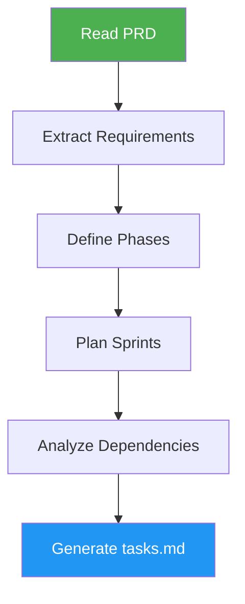

# Tasks Generator

> Transform PRD documents into structured, sprint-based development tasks with dependency analysis.

## Highlights

- Create sprint-based task plans from PRD requirements
- Perform dependency analysis with parallel task grouping and critical path
- Group tasks by phase: POC, MVP, and Full Features
- Link every task back to its PRD section

## When to Use

| Say this... | Skill will... |
|---|---|
| "Create tasks from PRD" | Generate sprint plan from requirements |
| "Break down the PRD" | Extract and organize development tasks |
| "Generate sprint tasks" | Build phased task plan with dependencies |

## How It Works



## Installation

Install via [npx (Vercel)](https://www.npmjs.com/package/skills):

```bash
npx skills add https://github.com/luongnv89/skills --skill tasks-generator
```

Or via [agent-skill-manager (asm)](https://www.npmjs.com/package/agent-skill-manager):

```bash
asm install github:luongnv89/skills:skills/tasks-generator
```

## Usage

```
/tasks-generator
```

## Resources

| Path | Description |
|---|---|
| `agents/requirements-extractor.md` | Read PRD and produce structured feature and requirement list |
| `agents/sprint-planner.md` | Define sprint scope (POC, MVP, full features) and produce sprint plan |
| `agents/sprint-worker.md` | Generate tasks for a single sprint (runs in parallel, one per sprint) |
| `agents/dependency-resolver.md` | Wire cross-sprint dependencies and produce final tasks.md |
| `references/tasks-template.md` | Task format template and sprint structure |

## Output

`tasks.md` with sprint-organized tasks, each including title, description, acceptance criteria, dependencies, and PRD reference. Includes dependency analysis with waves, critical path, and bottleneck identification.
