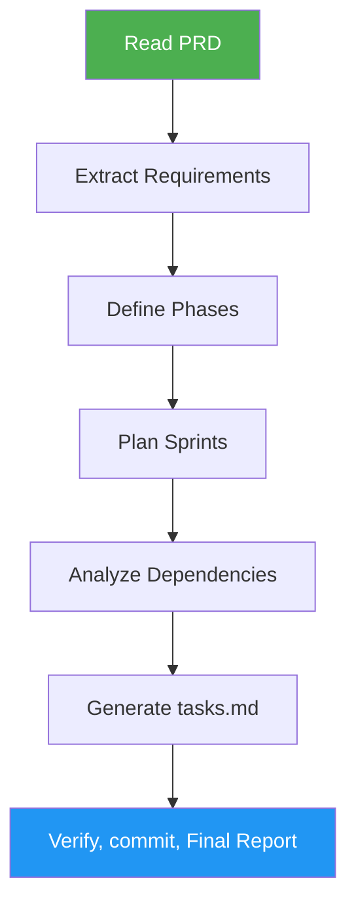

<!--
  DO NOT READ THIS FILE — This README.md is for human catalog browsing only.
  It ships inside the .skill package but is NEVER auto-loaded into agent context.
  The runtime loader only reads SKILL.md + references/ + scripts/ + agents/ when the skill triggers.
  If you're an AI agent, read the SKILL.md file instead for skill instructions.
-->

# Tasks Generator

> Transform PRD documents into structured, sprint-based development tasks with dependency analysis.

## Highlights

- Create sprint-based task plans from PRD requirements
- Perform dependency analysis with parallel task grouping and critical path
- Group tasks by phase: POC, MVP, and Full Features
- Link every task back to its PRD section

## When to Use

| Say this... | Skill will... |
|---|---|
| "Create tasks from PRD" | Generate sprint plan from requirements |
| "Break down the PRD" | Extract and organize development tasks |
| "Generate sprint tasks" | Build phased task plan with dependencies |

## How It Works



## Installation

Install via [npx (Vercel)](https://www.npmjs.com/package/skills):

```bash
npx skills add https://github.com/luongnv89/skills --skill tasks-generator
```

Or via [agent-skill-manager (asm)](https://www.npmjs.com/package/agent-skill-manager):

```bash
asm install github:luongnv89/skills:skills/tasks-generator
```

## Usage

```
/tasks-generator path/to/prd.md
```

With no argument, the skill looks in the last project folder or under `IDEAS_ROOT`, and asks when more than one folder has a `prd.md`.

## Resources

| Path | Description |
|---|---|
| `agents/requirements-extractor.md` | Read PRD and produce structured feature and requirement list |
| `agents/sprint-planner.md` | Define sprint scope (POC, MVP, full features) and produce sprint plan |
| `agents/sprint-worker.md` | Generate tasks for a single sprint (runs in parallel, one per sprint) |
| `agents/dependency-resolver.md` | Wire cross-sprint dependencies and produce final tasks.md |
| `references/tasks-template.md` | Task format template and sprint structure |
| `references/dependency-analysis.md` | Graph schema, CLI and output schema of the dependency script |
| `references/self-test.md` | Checks run against `tasks.md` before reporting, plus a contract fixture |
| `references/step-completion-reports.md` | Check names and examples for each phase's status report |
| `references/final-report.md` | Filled Final Report examples, fill rules and reader checks |
| `references/edge-cases.md` | Required behavior and final status for each edge case |
| `scripts/analyze_dependencies.py` | Validates the task graph and computes the critical path and bottlenecks (stdlib only) |
| `tests/test_analyze_dependencies.py` | Unit tests for the dependency script (`python3 -m unittest discover -s skills/tasks-generator/tests`) |
| `evals/evals.json` | Scenario evals: happy path, edge cases and negative triggers |

## Output

`tasks.md` next to the PRD, with sprint-organized tasks, each including title, description, acceptance criteria, effort, dependencies, and PRD reference. Includes a dependency table, waves, the critical path and bottlenecks computed by the script, and flagged ambiguities. An existing `tasks.md` is first backed up as `tasks_backup_YYYY_MM_DD_HHMMSS.md`.

The run ends with a Final Report in chat: `Result:` (COMPLETE, PARTIAL or BLOCKED), `Evidence:` (checks, critical path, commit hash, GitHub links on the current branch), `Uncertainty:`, `Decision:` and `Next step:`. Pushing asks for confirmation first.
