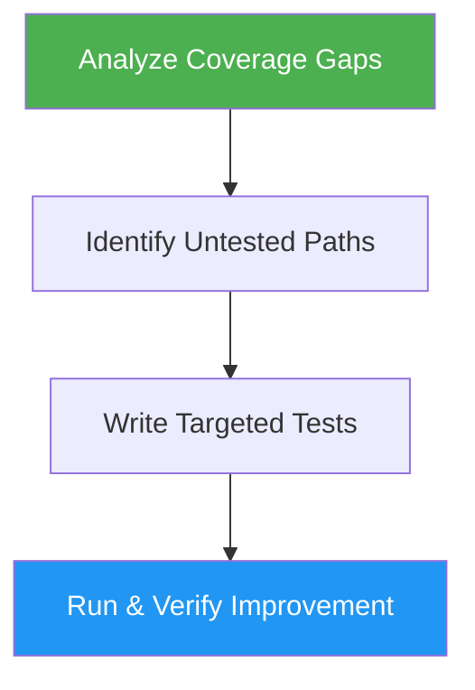

<!--
  DO NOT READ THIS FILE — This README.md is for human catalog browsing only.
  It ships inside the .skill package but is NEVER auto-loaded into agent context.
  The runtime loader only reads SKILL.md + references/ + scripts/ + agents/ when the skill triggers.
  If you're an AI agent, read the SKILL.md file instead for skill instructions.
-->

# Test Coverage

> Expand unit test coverage by targeting untested branches, edge cases, and error paths.

## Highlights

- Analyze existing coverage to identify specific gaps
- Target untested branches, error paths, and boundary values
- Adapt to any testing framework (Jest, Vitest, pytest, Go, Rust)
- Create feature branch automatically before adding tests

## When to Use

| Say this... | Skill will... |
|---|---|
| "Increase test coverage" | Find gaps and write new tests |
| "Add more tests" | Target untested branches and edges |
| "Cover edge cases" | Write tests for boundaries and errors |
| "Improve test coverage" | Measurably increase coverage metrics |

## How It Works



## Installation

Install via [npx (Vercel)](https://www.npmjs.com/package/skills):

```bash
npx skills add https://github.com/luongnv89/skills --skill test-coverage
```

Or via [agent-skill-manager (asm)](https://www.npmjs.com/package/agent-skill-manager):

```bash
asm install github:luongnv89/skills:skills/test-coverage
```

## Usage

```
/test-coverage
```

## Output

New test cases added to the project's existing test suite, following current patterns and naming conventions. Tests target error handling, boundary values, null/empty inputs, and async edge cases with measurably improved coverage.
