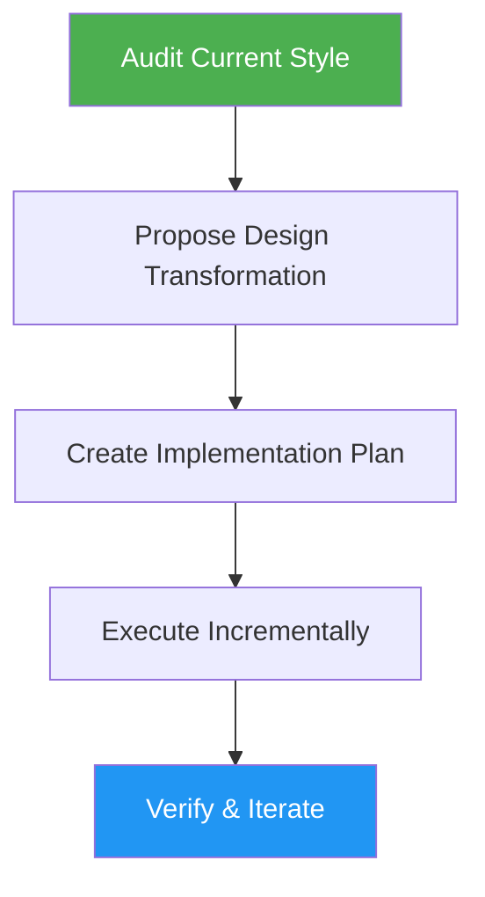

# Theme Transformer

> Transform existing interfaces into futuristic cyberpunk/neon themes while preserving usability and product clarity.

## Highlights

- Futuristic cyberpunk/neon/space design system with dark-first surfaces
- User-adjustable accent colors with automatic palette generation
- Approval-gated 4-step workflow (audit, propose, plan, execute)
- Preserves accessibility, readability, and keyboard navigation throughout

## When to Use

| Say this... | Skill will... |
|---|---|
| "Reskin this app with a dark cyberpunk theme" | Audit current styles, propose a neon transformation, execute incrementally |
| "Apply a futuristic theme to my dashboard" | Transform the dashboard with dark surfaces and electric accents |
| "Change the look to a space/neon aesthetic" | Migrate the design system to Neon Command Center style tokens |
| "Make this UI look more cyberpunk" | Retheme components with glow effects, dark backgrounds, and neon accents |

## How It Works



## Installation

Install via [npx (Vercel)](https://www.npmjs.com/package/skills):

```bash
npx skills add https://github.com/luongnv89/skills --skill theme-transformer
```

Or via [agent-skill-manager (asm)](https://www.npmjs.com/package/agent-skill-manager):

```bash
asm install github:luongnv89/skills:skills/theme-transformer
```

## Usage

```
/theme-transformer
```

## Resources

| Path | Description |
|---|---|
| `references/theme-tokens.md` | Core design tokens and mapping rules |
| `references/neon-command-center.md` | Full Neon Command Center style language |

## Output

- Updated theme tokens/CSS variables (CSS, Tailwind, or theme config)
- Transformed shared components and target pages
- Verification summary with before/after documentation
- All changes on a dedicated git branch
