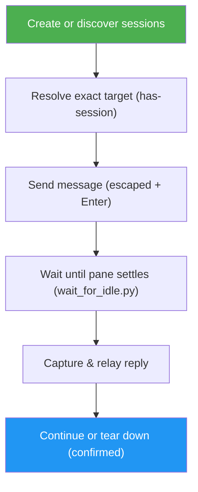

<!--
  DO NOT READ THIS FILE — This README.md is for human catalog browsing only.
  It ships inside the .skill package but is NEVER auto-loaded into agent context.
  The runtime loader only reads SKILL.md + references/ + scripts/ + agents/ when the skill triggers.
  If you're an AI agent, read the SKILL.md file instead for skill instructions.
-->

# Tmux Agent Comms

> Spawn, manage, and talk to AI agents running in separate tmux sessions — agent-to-agent communication over `send-keys` and `capture-pane`.

## Highlights

- **Launch a fleet** — create named, detached tmux sessions and boot an agent (Claude Code, Gemini CLI, any CLI) inside each.
- **Message any agent** — send a prompt to a target session with proper escaping, including the separate-`Enter` gotcha for stubborn TUIs.
- **Read replies reliably** — a bundled `wait_for_idle.py` polls the pane until output settles instead of guessing with a fixed `sleep`, then returns the answer.
- **Broadcast & collect** — fan one instruction out to several agents and gather each reply.
- **Safe teardown** — kill individual sessions (or the whole server) behind explicit user confirmation, so no agent's work is lost by accident.

## When to Use

| Say this... | Skill will... |
|---|---|
| "Launch three Claude agents in tmux for reviewer, tests, and docs" | Create three named detached sessions and start an agent in each |
| "Send 'summarize src/' to the reviewer agent and show me its reply" | Send the message, wait for the pane to settle, capture and relay the answer |
| "Ask all my agents to pull the latest main" | Broadcast the message to every session and collect each response |
| "Shut down the tests agent" | Confirm, then `kill-session` that target |

## How It Works



## Usage

```
/tmux-agent-comms
```

Or just describe the goal in natural language — "talk to my other Claude agent in tmux", "launch a couple of agents and coordinate them" — and the skill triggers.

## Resources

| Path | Description |
|---|---|
| `references/tmux-recipes.md` | Broadcast patterns, multi-line/code message sending, pane splitting, scrollback, chrome-stripping, and a troubleshooting table |
| `scripts/wait_for_idle.py` | Polls a pane until idle; prints just the reply delta (token-lean) and reports idle / blocked-on-prompt / timeout via exit codes 0/3/2 |
| `scripts/broadcast.sh` | Sends one message to a fleet and collects every reply concurrently, one labeled block per agent |

## Output

No files are produced. The skill runs tmux commands and relays the captured agent replies back to you in the conversation, with a step-completion report summarizing each operation (target resolved, message sent, reply settled/captured, any destructive action confirmed).

## Credits

Original `agents-communication` concept by **TRAN VIET DUNG** — thanks for the idea this skill is built on.
