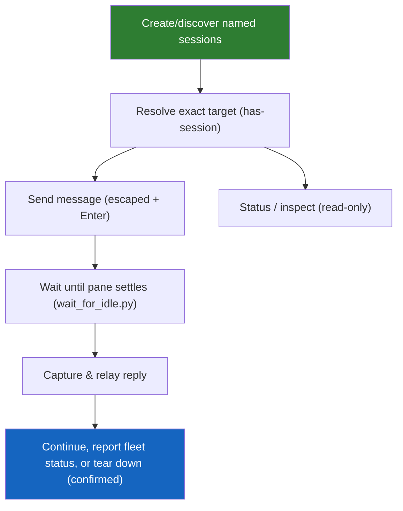

<!--
  DO NOT READ THIS FILE — This README.md is for human catalog browsing only.
  It ships inside the .skill package but is NEVER auto-loaded into agent context.
  The runtime loader only reads SKILL.md + references/ + scripts/ + agents/ when the skill triggers.
  If you're an AI agent, read the SKILL.md file instead for skill instructions.
-->

# Tmux Agent Comms

> Spawn, manage, and talk to AI agents running in separate tmux sessions — new sessions open in an app terminal tab by default, with agent-to-agent communication over `send-keys` and `capture-pane`.

## Highlights

- **Launch sessions** — create predictable tmux sessions (`<folder>-<short-task-name>`) and boot an agent (Claude Code, Gemini CLI, Codex, pi-agent, any CLI) inside each, opening new sessions in a terminal tab inside the current app by default.
- **Start non-blocking by default** — open a visible app tab when available, then continue readiness checks; use `TAC_STARTUP_MODE` or a per-launch request to opt into interactive-only startup when needed.
- **Message any agent** — send a prompt to a target session with proper escaping, including the separate-`Enter` gotcha for stubborn TUIs.
- **Read replies reliably** — a bundled `wait_for_idle.py` polls the pane until output settles instead of guessing with a fixed `sleep`, then returns the answer.
- **Broadcast & collect** — fan one instruction out to several agents and gather each reply, with periodic fleet status during long-running work.
- **Status & inspect** — list every managed agent in a table, inspect one agent, and get the exact attach command for a human terminal.
- **Keep agents visible** — new sessions attach to a fresh terminal tab in the current app by default; detached mode remains available for background fleets or environments without a terminal-tab facility.
- **Safe teardown** — kill individual sessions (or the whole server) behind explicit user confirmation, so no agent's work is lost by accident.

## When to Use

| Say this... | Skill will... |
|---|---|
| "Launch three Claude agents in tmux for reviewer, tests, and docs" | Create three named sessions (app terminal tabs by default) and start an agent in each |
| "Send 'summarize src/' to the reviewer agent and show me its reply" | Send the message, wait for the pane to settle, capture and relay the answer |
| "Ask all my agents to pull the latest main" | Broadcast the message to every session and collect each response |
| "Show status for my tmux agents" | Print a table with state, progress, start time, and working directory |
| "Inspect the reviewer agent" | Show details for that agent and the exact `tmux attach-session` command |
| "Shut down the tests agent" | Confirm, then `kill-session` that target |

## How It Works



## Usage

```
/tmux-agent-comms
```

Or just describe the goal in natural language — "talk to my other Claude agent in tmux", "launch a couple of agents and coordinate them" — and the skill triggers.

## Popular Use Cases

Each example is something you type to your agent. Start with `/tmux-agent-comms` to load the skill, then describe the goal — the skill handles the tmux mechanics (spawning, escaping, waiting for replies, confirming before anything destructive).

### 1. Talk to another agent you already have running

You've got a second Claude Code (or Gemini) running in a tmux session called `reviewer` and want to ask it something without switching windows.

```
/tmux-agent-comms ask the "reviewer" agent to summarize the open PRs, show me its reply
```

The skill resolves the `reviewer` session, sends the message, waits for the pane to settle (no fixed `sleep` guessing), and relays just the answer back to you — not the whole screen of box-drawing.

### 2. Launch a fleet and give them a shared task

Spin up several agents, each scoped to a job, and kick them all off at once.

```
/tmux-agent-comms launch three Claude agents in tmux named reviewer, tests, and docs in this repo, then ask each to report what it would work on first
```

The skill creates three predictably named sessions (for example, `myrepo-reviewer`, `myrepo-tests`, `myrepo-docs`) in app terminal tabs by default, boots an agent in each, waits for each to clear its boot/trust prompt, then messages them. The `<folder>-<short-task-name>` convention keeps later status, inspect, and attach commands self-documenting.

### 3. Broadcast one instruction to the whole fleet

Send the same message to every agent and collect all the replies together — the waits run concurrently, so it takes as long as the *slowest* agent, not the sum.

```
/tmux-agent-comms tell all my running agents to pull the latest main and report status
```

You get one labeled block per agent with its reply and a state tag (`idle` / `TIMEOUT` / `BLOCKED`), so you can see at a glance which agents are done and which need attention. Status uses the same meaning in scan-friendly words: `idle` maps to `done`, `BLOCKED` maps to `blocked`, and `TIMEOUT` maps to `unknown` unless a fresh capture is still changing (`in-progress`). For long runs, the orchestrator also reports fleet status about every 5 minutes without interrupting working panes.

### 3b. Check or inspect running agents

Use status when you want the whole fleet at a glance, or inspect when you need one agent's details and attach command.

```
/tmux-agent-comms show status for all managed agents
/tmux-agent-comms inspect the reviewer agent and show me how to attach
```

Status returns a table with session, state, progress, start time, and working directory. Inspect resolves one exact session and prints a human-run command such as `tmux attach-session -t myrepo-reviewer`.

### 4. Hand a long prompt or a code block to an agent

Pasting multi-line text or code into another agent normally breaks on shell quoting (`$`, backticks, `;`, newlines). The skill loads it via a tmux paste-buffer instead, so it lands literally.

```
/tmux-agent-comms send this function to the "tests" agent and ask it to write unit tests:
def f(x): return x * 2
```

No manual escaping — the skill writes the message to a buffer and pastes it into the target.

### 5. A fresh agent is stuck on a trust / auth prompt

A newly launched Gemini or Claude in an untrusted folder parks on a "Do you trust this folder?" dialog before its input box works. The skill detects this and refuses to type into it (a typed message would be read as menu input).

```
/tmux-agent-comms is my new "docs" agent ready to take a message yet?
```

If it's still on a dialog, the skill shows you the prompt and asks how to respond — it won't fire a message blind.

### 6. Shut an agent down (safely)

Killing a session loses that agent's unsaved work, so the skill always confirms first.

```
/tmux-agent-comms shut down the "tests" agent, I'm done with it
```

The skill confirms the target with you, then `kill-session`. (A full reset of every agent via `kill-server` likewise asks first — see the safety reminders below.)

## Resources

| Path | Description |
|---|---|
| `references/tmux-recipes.md` | Broadcast patterns, periodic fleet status, status/inspect behavior, multi-line/code message sending, pane splitting, scrollback, chrome-stripping, and a troubleshooting table |
| `scripts/wait_for_idle.py` | Polls a pane until idle; prints just the reply delta (token-lean) and reports idle / blocked-on-prompt / timeout via exit codes 0/3/2 |
| `scripts/broadcast.sh` | Sends one message to a fleet and collects every reply concurrently, one labeled block per agent |

## Output

No files are produced. The skill runs tmux commands and relays the captured agent replies back to you in the conversation, with a step-completion report summarizing each operation (target resolved, message sent, reply settled/captured, any destructive action confirmed).

## Credits

Original `agents-communication` concept by **TRAN VIET DUNG** — thanks for the idea this skill is built on.
