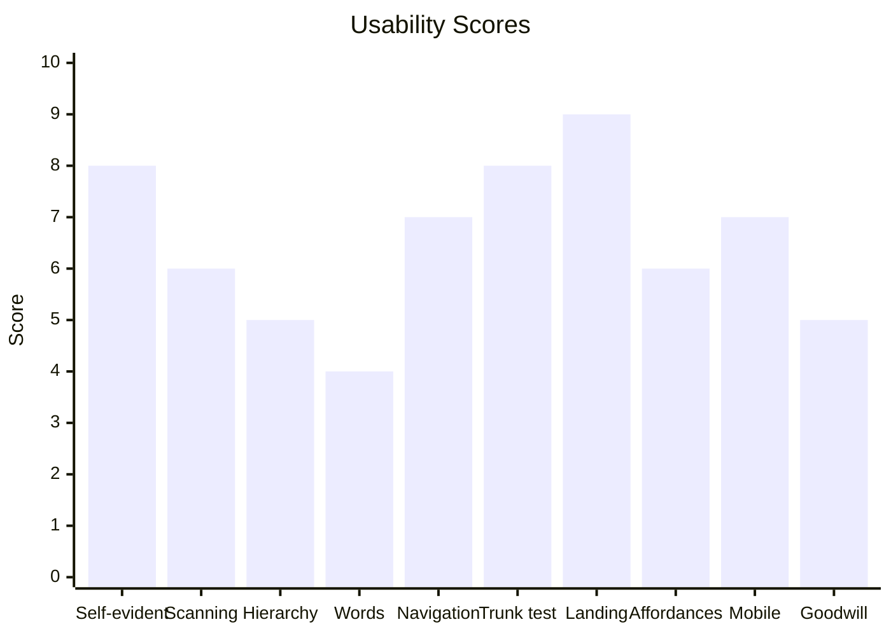
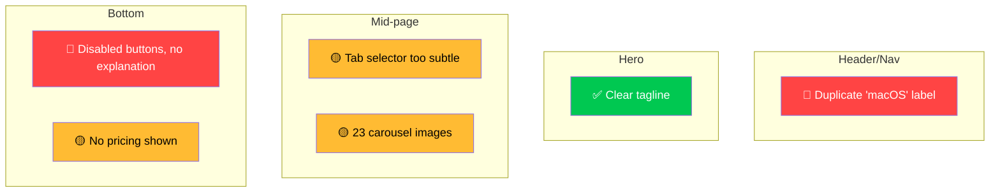
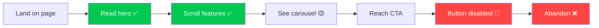

# Don't Make Me Think — Usability Review & Redesign

Evaluate and improve UIs through Steve Krug's "Don't Make Me Think" principles. The report itself must practice what Krug preaches: scannable, visual, zero fluff. A human should skim it in 30 seconds; an AI agent should be able to parse it and start fixing.

## When to Use

Trigger this skill when the user asks for a usability audit, UX review, or UI feedback on a screenshot, live URL, or HTML/CSS code. Do not use for visual/brand critique, WCAG accessibility audits, or backend/API review — route those elsewhere.

## Instructions

Follow this workflow to keep the agent's context budget tight:

1. **Check Prerequisites** — confirm input type and access (see below).
2. **Process Input** — handle per the Input Handling table.
3. **Evaluate** — apply applicable lenses from The Ten Lenses (see `references/krug-principles.md` for token-efficient deep dives).
4. **Generate Report** — use the Report Format template verbatim.
5. **Redesign (optional)** — only if user requests fixes; always confirm before destructive edits.

## Prerequisites

- **Browser access**: `/browse` skill available for live URL analysis
- **Input available**: one of — live URL, screenshot/image, HTML/CSS code, wireframe, or verbal description
- **Code editor access** (Redesign Mode only): write permission to the UI source files being modified

## Input Handling

| Input type | Action |
|---|---|
| Screenshot/image | Analyze visually |
| Live URL | Use `/browse` to navigate, screenshot, interact |
| HTML/CSS/JS code | Read code, focus on user experience |
| Wireframe/mockup | Focus on information architecture, not polish |
| Verbal description | Ask clarifying questions first |

## The Ten Lenses

Evaluate through whichever lenses apply. Read `references/krug-principles.md` for deep detail on any principle.

| # | Lens | Core question |
|---|---|---|
| 1 | Self-evidence | Would a user pause to figure out what this is or does? |
| 2 | Scanning | Can you grasp the page structure in 2-3 seconds? |
| 3 | Visual hierarchy | Does visual weight match importance? |
| 4 | Word economy | Does every word earn its place? |
| 5 | Navigation | Do you always know where you are and how to move? |
| 6 | Trunk test | Drop here cold — can you answer: what site? what page? what can I do? |
| 7 | Landing clarity | Within 5 seconds, can you explain what this site does? |
| 8 | Affordances | Is it instantly clear what's clickable/tappable? |
| 9 | Mobile | Touch targets, reachability, no hidden gestures? |
| 10 | Goodwill | Does the UI respect the user's time and trust? |

## Report Format

The review output must be **concise, visual, and skimmable**. Think bullet points, tables, and diagrams — not paragraphs. The report serves two audiences simultaneously: a human who wants to skim in 30 seconds, and an AI agent who needs enough context to implement fixes.

Use this exact template:

~~~markdown
# Usability Review: [Page/Screen Name]

## Thinking Cost: [LOW | MODERATE | HIGH]

> [One sentence: what's the single biggest usability problem on this page]

## Scorecard

Rate each applicable lens 0-10. Use a mermaid chart to visualize.



| Lens | Score | Why |
|---|---|---|
| Self-evidence | 8/10 | Labels are clear, one ambiguous nav item |
| ... | ... | ... |

## Issues

Use severity icons: 🔴 Critical, 🟡 Moderate, 🟢 Minor

### 🔴 [Short issue title]
- **Problem:** [one line — what the user experiences]
- **Impact:** [one line — what happens because of this]
- **Fix:** [one line — specific, actionable, concrete]
- **Where:** [element/section/selector if applicable]

### 🟡 [Short issue title]
...

### 🟢 [Short issue title]
...

## Issue Map

Show where issues cluster on the page using a mermaid diagram.



## Page Flow Analysis

When relevant, show the user's journey and where friction occurs.



## What Works

Bullet list — protect these during redesign:
- ✅ [Good thing 1]
- ✅ [Good thing 2]

## Fix Priority

| Priority | Issue | Effort | Impact |
|---|---|---|---|
| 1 | [issue] | Low | High |
| 2 | [issue] | Medium | High |
| 3 | [issue] | Low | Medium |
~~~

### Report Rules

- **No paragraphs.** Use bullet points, tables, and mermaid diagrams.
- **One line per finding.** Problem, impact, fix — each one line max.
- **Be specific.** "Move price next to download button" not "improve transparency."
- **Include selectors/locations.** An AI agent reading this should know exactly where to look.
- **Diagrams over descriptions.** If you can show it in a mermaid chart or flowchart, do that instead of writing about it.
- **Severity is visual.** 🔴🟡🟢 — no walls of text explaining severity levels.
- **Scores are honest.** A 10/10 means flawless. Most things are 5-8. Don't grade inflate.

## Redesign Mode

When the user wants fixes applied (not just reported), every destructive edit requires an explicit dry-run preview and user confirmation before writing:

1. Produce the review first (same format above).
2. **Dry-run first** — show the planned diff (file path, selector, before/after) and wait for explicit user confirmation. Treat unconfirmed edits as a backup safety check; never write without an approval.
3. Fix critical (🔴) issues first, then moderate (🟡).
4. Change the minimum necessary — surgical, not a rewrite.
5. Preserve brand/aesthetic — make it more intuitive, not different.
6. After each fix, show before/after; if a write fails, rollback by reverting the file from git.

If working with code, edit files directly only after confirmation. For screenshots, provide specs an AI agent or developer can implement without guessing.

## Error Handling

| Situation | Action |
|---|---|
| `/browse` fails or URL is unreachable | Ask user for a screenshot or HTML export; do not proceed with assumptions |
| Screenshot cannot be loaded or parsed | Ask user to re-share as PNG/JPEG or paste the relevant HTML |
| HTML/CSS code is incomplete | Note missing sections in the review; evaluate only what is present |
| No input provided | Ask for one of: URL, screenshot, code snippet, or verbal description before starting |
| Redesign Mode — file not writable | Report the permission issue; provide specs as code comments instead |

## Expected Output

A completed usability review delivers a structured `Usability Review` markdown report containing:
- **Thinking Cost** rating (LOW / MODERATE / HIGH)
- **Scorecard** table with 0-10 scores per applicable lens
- **Issues** list with 🔴🟡🟢 severity icons, one-line problem/impact/fix per item
- **Issue Map** mermaid diagram showing where problems cluster
- **Fix Priority** table ordered by effort/impact

Example summary line:
```
Thinking Cost: HIGH — 3 critical issues found (disabled button, missing nav labels, no landing clarity)
```

## Edge Cases

| Scenario | Handling |
|---|---|
| Input is a verbal description only | Ask clarifying questions before evaluating; do not guess at UI elements not described |
| Screenshot of a native mobile app (not web) | Apply mobile-specific lenses (9 — Mobile) with extra weight; note platform-specific conventions |
| User wants "just a quick check" | Deliver a condensed review (top 3 issues only) rather than the full 10-lens report |
| Redesign Mode on a CSS framework (Tailwind, Bootstrap) | Preserve the framework classes; only change values, not the framework itself |
| UI has no issues | Output the scorecard with high scores and a "What Works" section only; do not fabricate problems |

## Acceptance Criteria

- [ ] Review covers all applicable lenses from The Ten Lenses table
- [ ] Every issue entry includes Problem, Impact, Fix, and Where fields (one line each)
- [ ] Mermaid Issue Map diagram is included showing issue locations on the page
- [ ] Fix Priority table is sorted by impact (highest first)
- [ ] Redesign Mode shows a before/after for each fix applied
- [ ] Report is skimmable in 30 seconds — no long paragraphs, tables and bullets only

## Step Completion Reports

After each major phase, emit a status report. See `references/step-completion-reports.md` for the template and per-phase check names.

## Working With Live Sites

1. Navigate to the page, take screenshots
2. Interact with key elements (buttons, nav, forms)
3. Check responsive behavior
4. Produce the review based on real interaction
