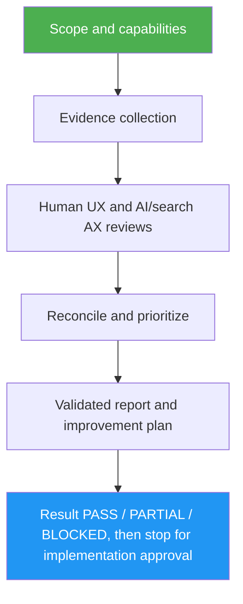

<!--
  DO NOT READ THIS FILE — This README.md is for human catalog browsing only.
  It ships inside the .skill package but is NEVER auto-loaded into agent context.
  The runtime loader only reads SKILL.md + references/ + scripts/ + agents/ when the skill triggers.
  If you're an AI agent, read the SKILL.md file instead for skill instructions.
-->

# UX / AX Review

> Audit websites and apps for humans and AI/search, then turn supported findings into an approval-gated improvement plan.

Version: **1.2.0** · Author: Luong NGUYEN · License: MIT

## Highlights

- Six human aspects: clarity, brand, responsive, accessibility, performance, conversion.
- Six AI/search aspects: robots/sitemap, structured data, Markdown, llms.txt, crawler access, copy/share/open-in-AI.
- Live URL, repository, supplied evidence and native-app modes; untested is not passed.
- Focused parallel reviewers for substantial audits, inline fallback; no other skills required.
- Report-only first: fixes, commits, publishing and access-policy changes need separate approval.

## When to Use

| Say this... | Skill will... |
|---|---|
| “Review UX and AI discoverability for this website.” | Inspect a bounded public sample and produce an evidence-backed plan |
| “Audit this app from its screenshots and code.” | Separate observed issues from hypotheses and missing tests |
| “Review this native-only desktop app.” | Apply native UX checks without prescribing web crawler files |
| “Plan human and AI improvements from this saved HTML.” | Use supplied evidence without pretending it is a live/rendered test |

## How It Works



## Installation

Install via [agent-skill-manager (asm)](https://www.npmjs.com/package/agent-skill-manager):

```bash
asm install github:luongnv89/skills:skills/ux-ax-review
```

No other skill is required. Python 3 is optional and only runs the report validator.

## Usage

```text
/ux-ax-review https://example.com
/ux-ax-review /path/to/app -- output outside the app checkout
```

These are prompt examples, not executable CLI flags. Supply the audience, primary goal,
constraints and desired output directory when known. Missing tools yield a partial review.
Python 3 is optional for report validation; no packages are needed by the validator.

## Output

- `UX_AX_REVIEW.md`: scoped 12-aspect coverage, evidence-backed findings and phased plan.
- `ux-ax-findings.json`: stable evidence/finding/task references and acceptance checks.
- A final response that opens with `Result: PASS | PARTIAL | BLOCKED` and a one-line reason,
  then lists the top priorities, the evidence (artifact paths, validator result), what stayed
  uncertain or not tested, and a choice-of-task-IDs implementation offer. No source edits during audit.
- `PARTIAL` means the artifacts were written but some aspect was not tested for missing evidence
  or tools. `BLOCKED` means nothing was audited, and the response names the input you need to supply.

The validator checks structure, not truth, certification, ranking, citation or conversion outcomes.
llms.txt and Markdown exports are optional opportunities, not universal search requirements.
Native-only apps do not need web crawler artifacts. Private information must not be published
or sent to third-party AI services as an “improvement.”

## Resources

| Path | Description |
|---|---|
| `references/evidence-rules.md` | Aspect ids, coverage statuses and how evidence records are written |
| `references/human-ux.md` | Checklist for the six human UX aspects |
| `references/ai-search-ax.md` | Checklist for the six AI/search AX aspects |
| `references/web-evidence.md` | Live-web and repository evidence limits, and the checkout snapshot |
| `references/native-app.md` | How human and AX checks apply to native-only apps |
| `references/report-contract.md` | Markdown headings, JSON fields, triage bands and validator scope |
| `references/final-report.md` | Status rule (PASS/PARTIAL/BLOCKED), final response shape, step results and understanding criteria |
| `references/repo-sync.md` | Confirm-first sync steps for an output directory inside a git worktree |
| `references/orchestrated-runs.md` | The `orchestrated-by`, `evidence-dir`, `skip-checks` and `output-dir` lines an orchestrator such as `design-optimizer` may pass |
| `agents/human-reviewer.md` | Bounded human UX reviewer contract |
| `agents/ax-reviewer.md` | Bounded AI/search reviewer contract |
| `scripts/validate_report.py` | Stdlib-only report coverage/reference validator |
| `tests/` | Executable validator regression tests and their TDD notes |
| `evals/evals.json` | Behavior evals: 3 happy-path, 3 edge, 2 negative-trigger |
| `evals/files/` | Synthetic web, repo, native, blocked and orchestrated-run fixtures |

## Verification

```bash
python3 -m unittest discover -s skills/ux-ax-review/tests -v
python3 skills/ux-ax-review/scripts/validate_report.py /path/to/ux-ax-findings.json --markdown /path/to/UX_AX_REVIEW.md
```

Behavioral eval results are stored in a separate ignored workspace, not shipped as claims
about real websites. This skill does not replace a comprehensive accessibility assessment.
