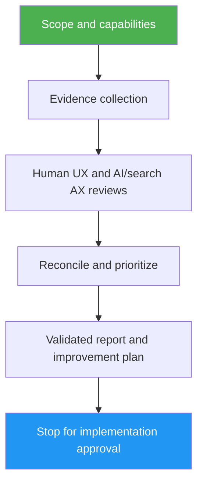

<!--
  DO NOT READ THIS FILE — This README.md is for human catalog browsing only.
  It ships inside the .skill package but is NEVER auto-loaded into agent context.
  The runtime loader only reads SKILL.md + references/ + scripts/ + agents/ when the skill triggers.
  If you're an AI agent, read the SKILL.md file instead for skill instructions.
-->

# UX / AX Review

> Audit websites and apps for humans and AI/search, then turn supported findings into an approval-gated improvement plan.

Version: **1.0.3** · Author: Luong NGUYEN · License: MIT

## Highlights

- Six human aspects: clarity, brand, responsive, accessibility, performance, conversion.
- Six AI/search aspects: robots/sitemap, structured data, Markdown, llms.txt, crawler access, copy/share/open-in-AI.
- Live URL, repository, supplied evidence and native-app modes; untested is not passed.
- Focused parallel reviewers for substantial audits, inline fallback; no other skills required.
- Report-only first: fixes, commits, publishing and access-policy changes need separate approval.

## When to Use

| Say this... | Skill will... |
|---|---|
| “Review UX and AI discoverability for this website.” | Inspect a bounded public sample and produce an evidence-backed plan |
| “Audit this app from its screenshots and code.” | Separate observed issues from hypotheses and missing tests |
| “Review this native-only desktop app.” | Apply native UX checks without prescribing web crawler files |
| “Plan human and AI improvements from this saved HTML.” | Use supplied evidence without pretending it is a live/rendered test |

## How It Works



## Usage

```text
/ux-ax-review https://example.com
/ux-ax-review /path/to/app -- output outside the app checkout
```

These are prompt examples, not executable CLI flags. Supply the audience, primary goal,
constraints and desired output directory when known. Missing tools yield a partial review.
Python 3 is optional for report validation; no packages are needed by the validator.

## Output

- `UX_AX_REVIEW.md`: scoped 12-aspect coverage, evidence-backed findings and phased plan.
- `ux-ax-findings.json`: stable evidence/finding/task references and acceptance checks.
- Completion summary and a choice-of-task-IDs implementation offer. No source edits during audit.

The validator checks structure, not truth, certification, ranking, citation or conversion outcomes.
llms.txt and Markdown exports are optional opportunities, not universal search requirements.
Native-only apps do not need web crawler artifacts. Private information must not be published
or sent to third-party AI services as an “improvement.”

## Resources

| Path | Description |
|---|---|
| `references/` | Evidence rules, UX/AX checklists, mode limits and report contract |
| `agents/` | Bounded human and AI/search reviewer contracts |
| `scripts/validate_report.py` | Stdlib-only report coverage/reference validator |
| `tests/` | Executable validator regression tests |
| `evals/` | Realistic synthetic audit fixtures and behavioral expectations |

## Verification

```bash
python3 -m unittest discover -s skills/ux-ax-review/tests -v
python3 skills/ux-ax-review/scripts/validate_report.py /path/to/ux-ax-findings.json --markdown /path/to/UX_AX_REVIEW.md
```

Behavioral eval results are stored in a separate ignored workspace, not shipped as claims
about real websites. This skill does not replace a comprehensive accessibility assessment.
