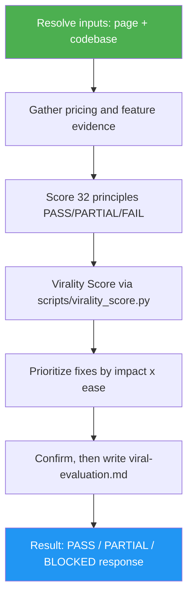

<!--
  DO NOT READ THIS FILE — This README.md is for human catalog browsing only.
  It ships inside the .skill package but is NEVER auto-loaded into agent context.
  The runtime loader only reads SKILL.md + references/ + scripts/ + agents/ when the skill triggers.
  If you're an AI agent, read the SKILL.md file instead for skill instructions.
-->

# Viral Product Evaluator

> Audit a product's codebase and landing page against the 32 principles of viral products, then get a Virality Score and a prioritized list of what to fix next.

## Highlights

- Scores all **32 viral-product principles** as PASS / PARTIAL / FAIL with concrete, product-specific evidence
- Reads **two inputs** — your codebase (pricing, paywall, subscription, feature surface) and your landing page (live URL via headless browser, a local HTML/JSX/MDX file, or auto-detected from the repo)
- Rolls up a **Virality Score /100** and a tier: Viral-ready · Promising · Needs work · Not viral yet
- Delivers a **prioritized fix list** ordered by impact × ease — each fix quotes what you have *now* and the exact change to make
- **Flags low-confidence verdicts** (OG-image punch, founder presence, emotional headline, novelty) so you know what still needs a human's eye
- Honors **strategic context** ("our free tier is intentional") without quietly inflating the score
- Every run ends with a `Result: PASS | PARTIAL | BLOCKED` line plus Evidence, Uncertainty and Decision

## When to Use

| Say this... | Skill will... |
|---|---|
| "Make this product more viral" | Score all 32 principles and return a prioritized fix list |
| "Review my landing page against the 32 principles" | Fetch the page, grade it, and show what's satisfied vs missing |
| "What should I change first to grow this?" | Order the gaps by impact × ease with concrete before/after fixes |
| "Grade my SaaS for shareability" | Produce a Virality Score, scorecard, strengths, and caveats |

## How It Works



## Installation

Install via [agent-skill-manager (asm)](https://www.npmjs.com/package/agent-skill-manager):

```bash
asm install github:luongnv89/skills:skills/viral-product-evaluator
```

Live-URL audits also need gstack's `/browse`. The skill checks for it before fetching and, when `asm deps` is available, leases it for the run and releases it at the end. Local-file and orchestrated runs need nothing else.

## Usage

```
/viral-product-evaluator
```

Then point it at a landing page (URL or file) and a codebase path. Add any strategic context (e.g. "we stay subscription on purpose") and it will factor that into the read. It asks before fetching a live page and before writing the report.

## Resources

| Path | Description |
|---|---|
| `references/principles.md` | The full 32-principle rubric: per-principle checks, evidence source, PASS/PARTIAL/FAIL bars, confidence flags, and the scoring formula |
| `references/report-template.md` | The exact report shape — verdict block, scorecard, prioritized fixes, strengths, caveats |
| `references/final-report.md` | The closing chat response: status rule (PASS / PARTIAL / BLOCKED) and response shapes |
| `references/repo-sync.md` | The confirm-first sync procedure when the report path is inside a git worktree |
| `references/step-reports.md` | Step Completion Report formats for the three phases |
| `references/honest-evaluation.md` | The candor rules: no inflated scores, no invented flaws, labeled low-confidence |
| `references/orchestrated-runs.md` | The member contract for orchestrators (`orchestrated-by`, `evidence-dir`, `skip-checks`, `output-dir`) |
| `scripts/virality_score.py` | Deterministic Virality Score + tier helper, with unit tests in `tests/` |

## Output

A `viral-evaluation.md` report (plus an inline summary) containing:

1. **Verdict block** — `Result:` line, Virality Score /100, tier, and PASS/PARTIAL/FAIL counts
2. **Scorecard** — all 32 principles grouped, each with one line of specific evidence
3. **Top fixes** — prioritized, ordered, with current-vs-proposed for each
4. **What's already working** — the strengths to preserve
5. **Caveats** — every low-confidence verdict and what a human should double-check

The closing chat response opens with `Result: PASS | PARTIAL | BLOCKED` and ends with the next decision. A run with no usable inputs ends `BLOCKED` and writes nothing.
