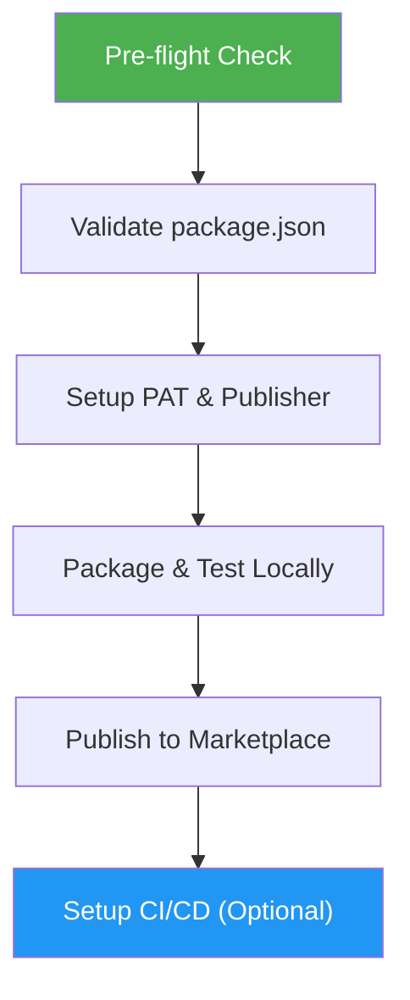

# VS Code Extension Publisher

> Publish VS Code extensions to the Visual Studio Marketplace with guided setup, validation, and CI/CD automation.

## Highlights

- Pre-flight validation of environment and package.json before publishing
- Step-by-step PAT creation and publisher identity setup
- Automated packaging, local testing, and marketplace publishing
- GitHub Actions workflow template for CI/CD auto-publishing on tags

## When to Use

| Say this... | Skill will... |
|---|---|
| "publish my vscode extension" | Run pre-flight checks, validate package.json, guide through full publish flow |
| "setup marketplace publishing" | Walk through PAT creation, publisher registration, and first publish |
| "publish a minor update" | Bump version and publish with `vsce publish minor` |
| "setup GitHub Actions to auto-publish" | Generate CI/CD workflow with tag-based publishing |

## How It Works



## Usage

```
/vscode-extension-publisher
```

## Output

- Validated and published `.vsix` extension on the VS Code Marketplace
- (Optional) `.github/workflows/publish.yml` for automated releases

## Resources

| Path | Description |
|---|---|
| `scripts/preflight-check.sh` | Validates Node.js, npm, vsce, and package.json fields |
| `references/publishing-guide.md` | Detailed reference for PAT, publisher, packaging, and CI/CD |
| `assets/github-actions-publish.yml` | GitHub Actions workflow template for auto-publishing |
