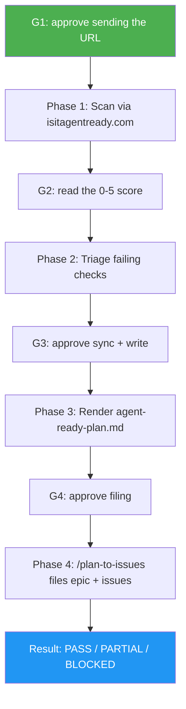

<!--
  DO NOT READ THIS FILE — This README.md is for human catalog browsing only.
  It ships inside the .skill package but is NEVER auto-loaded into agent context.
  The runtime loader only reads SKILL.md + references/ + scripts/ + agents/ when the skill triggers.
  If you're an AI agent, read the SKILL.md file instead for skill instructions.
-->

# Website Agent Readiness

> Scan a live website for AI-agent readiness, turn the gaps into a reviewed plan, and file them as tracked GitHub issues — with a human approval gate before every step.

Version: **1.4.0** · Author: Luong NGUYEN · License: MIT

## Highlights

- **Real scan, not a guess** — posts to `isitagentready.com/api/scan` and reads back a 0–5 readiness level across 22 checks in 5 categories (discoverability, content access, bot control, agent/API discovery, commerce).
- **Approval-gated end to end** — four gates. Nothing leaves your machine, gets written, or reaches GitHub without an explicit yes.
- **Plans, never edits** — no file on the target site is touched. The output is `agent-ready-plan.md` plus issues someone then works.
- **Speaks `/plan-to-issues` natively** — the plan is rendered in the exact grammar that skill parses, so filing is a delegation, not a re-implementation.
- **Deterministic triage** — phase, effort band, and priority come from a fixed mapping, so two runs on the same scan produce the same plan.
- Every run closes with a `Result: PASS | PARTIAL | BLOCKED` line plus Evidence, Uncertainty and Decision.

## When to Use

| Say this...                                      | Skill will...                                                        |
| ------------------------------------------------ | -------------------------------------------------------------------- |
| "make example.com agent-ready"                    | Run all four phases, gate by gate                                     |
| "is my site ready for AI agents?"                 | Scan and report the score, then offer to plan the gaps                |
| "score example.com for llms.txt and MCP support"  | Scan and show the per-category pass/fail table                        |
| "turn that agent-readiness scan into issues"      | Pick up at the plan and filing phases                                 |

**Not this skill:** applying the fixes to a codebase (`/seo-ai-optimizer`), App Store optimisation (`/aso-marketing`), or filing a plan you already wrote (`/plan-to-issues` directly).

## How It Works



## Installation

Install via [agent-skill-manager (asm)](https://www.npmjs.com/package/agent-skill-manager):

```bash
asm install github:luongnv89/skills:skills/website-agent-readiness
```

Phase 4 delegates filing to `/plan-to-issues`, maintained in [luongnv89/idd](https://github.com/luongnv89/idd). The skill checks for it before the plan is written and, when `asm deps` is available, leases it for the run and releases the lease at the end:

```bash
asm install https://github.com/luongnv89/idd --skill plan-to-issues -p claude --yes
```

## Usage

```
/website-agent-readiness https://example.com
```

Or just ask: *"can you make example.com agent-ready?"*

Artifacts land in `.agent-ready/` (scan data) and `agent-ready-plan.md` (the plan, at repo root).

## Requirements

- `curl` and `python3` — Phases 1–3.
- A publicly reachable target. The scanner fetches the site itself, so `localhost`, private IPs, and password-walled staging hosts cannot be scanned.
- Phase 4 only: a git repo with a GitHub remote, `gh` authenticated (`gh auth status`), and the `plan-to-issues` skill (see Installation).

## Resources

| Path | Description |
| ---- | ----------- |
| `references/scan-api.md` | The scan API contract, the 22-check inventory, and the category → phase mapping |
| `references/plan-format.md` | The `agent-ready-plan.md` grammar `/plan-to-issues` parses, with its three verification commands |
| `references/final-report.md` | The closing response: status rule (PASS / PARTIAL / BLOCKED), response shapes, reader checks |
| `references/repo-sync.md` | The confirm-first, stash-first branch sync that runs after gate G3 |
| `references/prompt-injection.md` | The full untrusted-data rules for scan content |
| `references/edge-cases.md` | The full edge-case table (unreachable hosts, empty scans, deferred commerce, and more) |
| `references/step-reports.md` | The per-phase Step Completion Report format |
| `references/leading-terms.md` | The skill's vocabulary |
| `references/orchestrated-runs.md` | The member contract for orchestrators (`orchestrated-by`, `evidence-dir`, `skip-checks`, `output-dir`) |
| `scripts/scan_site.sh` | Both scan API calls → `scan.json` + `fixes.md` |
| `scripts/triage_scan.py` | Phase-assigns failing checks → `triage.json` + table |
| `scripts/render_plan.py` | Renders the `/plan-to-issues` grammar |
| `evals/` | 13 trigger evals plus an orchestrated-evidence fixture set |

## Output

Two artifacts and a tracker state: `.agent-ready/` scratch (never committed) and `agent-ready-plan.md`, the one deliverable, in the grammar `/plan-to-issues` parses. Phase 4 leaves one epic plus one issue per plan task in the repo. The closing chat response opens with `Result: PASS | PARTIAL | BLOCKED` and ends with the next decision; a run with no usable URL ends `BLOCKED` and writes nothing.

## Notes

- The URL is sent to **isitagentready.com**, a third-party service, which then fetches the site. Gate G1 exists so that is an explicit choice.
- The scanner hosts an implementation guide per check. The plan **links** them; it does not fetch or apply them.
- A site the scanner reports as non-commerce gets its commerce checks deferred rather than filed.

## Verification status

| Phase | How far it has been exercised |
|---|---|
| 1–3 (scan → triage → plan) | End-to-end against three live sites at different score levels — `example.com` (0/5), `stripe.com` (1/5), `isitagentready.com` (4/5). Task counts, effort bands and acceptance-criteria coverage matched triage on every run. |
| 4 (file the issues) | Exercised end-to-end against a live repository (#114): a real 6-task plan rendered from the `isitagentready.com` scan was filed by `/plan-to-issues agent-ready-plan.md` into a throwaway repo — one epic created and bound to the plan (`<!-- plan-to-issues:plan=agent-ready-plan.md -->`), one issue per task (`Part of #<epic>`), and all six registered as native sub-issues. A second run on the same plan filed nothing — marker-based epic reuse and per-task dedup are confirmed idempotent. |

The eval suite is executable: `python3 scripts/run-skill-evals.py website-agent-readiness` from the repo root (see CONTRIBUTING.md). It measures triggering of the **installed** skill (`~/.claude/skills/website-agent-readiness`), so install the current copy first (`asm install github:luongnv89/skills:skills/website-agent-readiness -p claude --yes`, or `install.sh`) — the runner warns on a description mismatch. The suite holds 13 cases (4 happy-path, 6 edge, 3 negative-trigger) with 46 transcript-level expectations, reported as `[MANUAL]`; cases 3, 4 and 13 declare `files:` fixtures and skip by design.

Last recorded run (3 runs per case, recorded for #114 against the 1.2.4 suite): **8/8 triggering cases pass, 2 skipped as fixture-dependent** — including the two trigger-coverage gaps fixed by the 1.2.4 description widening — and the three negative-trigger cases stay at 0/3.
