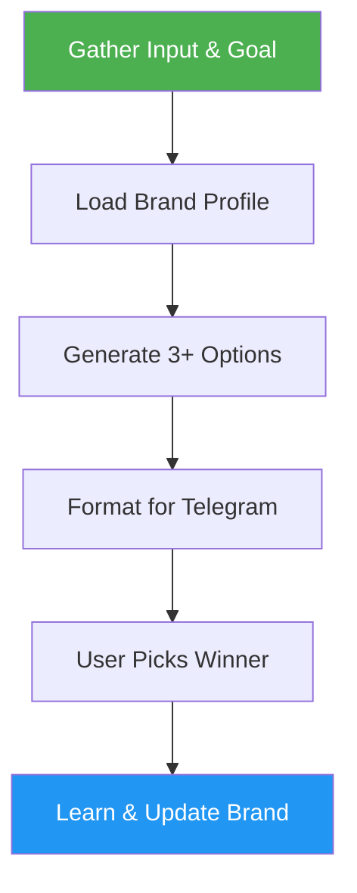

# X Post Generator

> Generate X (Twitter) posts from drafts and ideas with hashtags, brand alignment, and learning.

## Highlights

- Generate 3+ distinct post options with up to 5 relevant hashtags
- Format for Telegram one-tap copy using code blocks
- Load and maintain brand voice profile from references/brand.md
- Auto-learn from accepted posts to refine future suggestions

## When to Use

| Say this... | Skill will... |
|---|---|
| "Create a tweet" | Generate post options from your idea |
| "Generate X posts" | Create multiple variants with hashtags |
| "Rewrite draft for X" | Polish existing draft into post format |

## How It Works



## Usage

```
/x-post-generator <draft or idea>
```

## Resources

| Path | Description |
|---|---|
| `references/` | Brand voice profile (brand.md) |
| `scripts/` | Brand learning and update scripts |

## Output

3+ X post options in code blocks (Telegram copy-friendly), each with post body, hashtags, and media line if applicable. Brand profile auto-updated with learnings from accepted posts.
